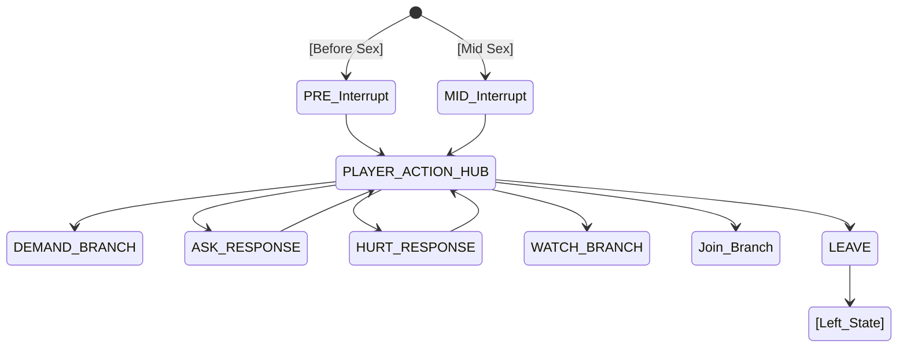
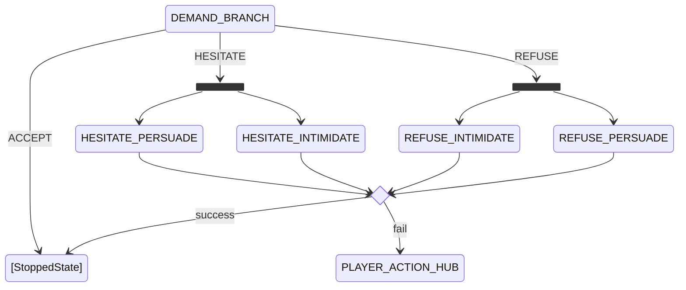
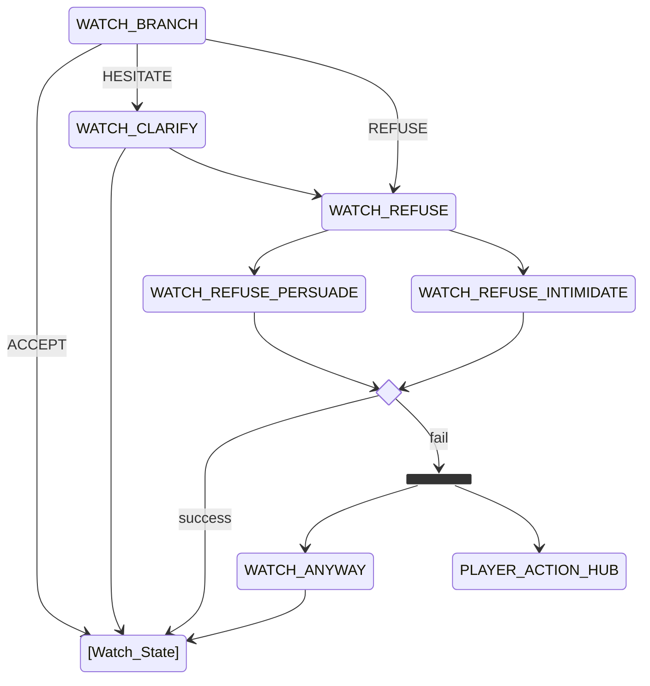
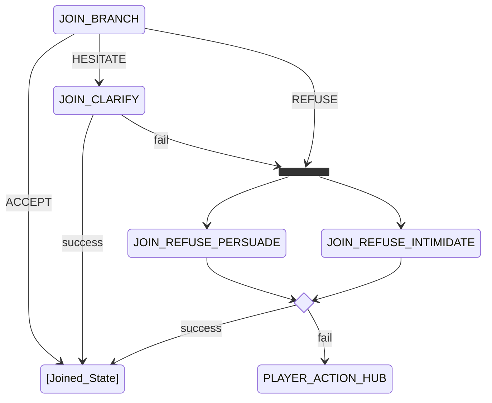
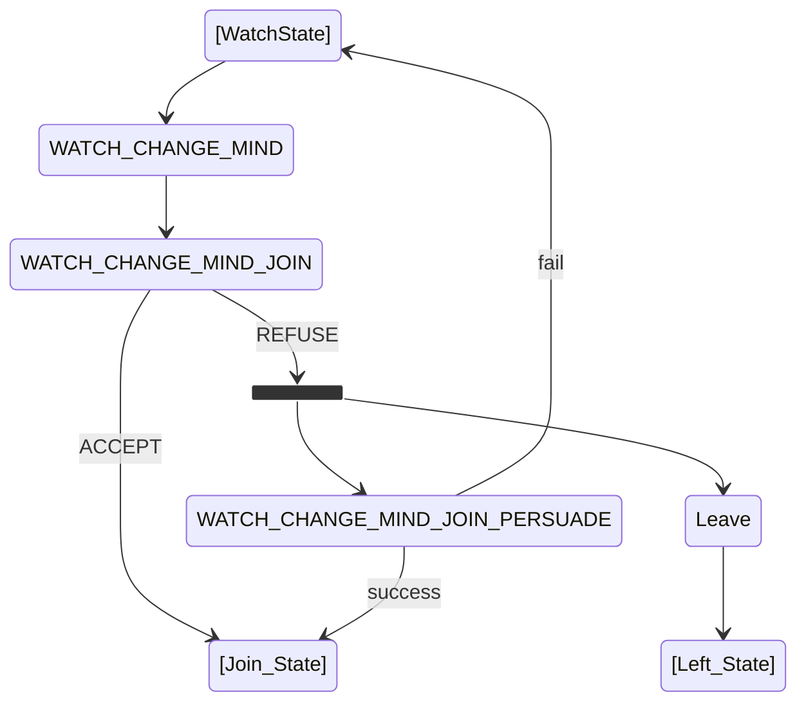
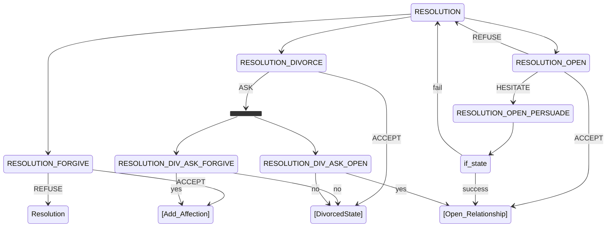

# Quest dialogue branches

| Variable | Type | Meaning |
|----------|------|---------|
| **GUILT** | Counter 0-100 | Moral conflict about affair |
| **STANCE** | Counter 0-100 | Accepts player authority (low) vs makes demands (high) |

**Guilt Ranges:** HIGH (67-100), MID (34-66), LOW (0-33)
**Stance Ranges:** LOW (0-33), MID (34-66), HIGH (67-100)

## When player tries to interrupt spouse before or during sex

<strong>PRE_Interrupt</strong> (Click to expand)

### GUILT_HIGH (67-100)

| Temperament | Stance 0-33 | Stance 34-66 | Stance 67-100 |
|-------------|-------------|--------------|---------------|
| **Humble** | "Gods... you're here? I... I don't know what to say. I've shamed us both. Please, don't look at me like that..." | "Wait! It's not... I mean, I shouldn't be here. I was just leaving. Please, let's talk somewhere else, away from these eyes..." | "By the Eight... you weren't supposed to see this. I've been so weak. I'm so sorry... I've made a mess of everything." |
| **Proud** | "You... here? This looks... damn it, it looks exactly like what it is. I won't lie to you, but I never meant for this." | "I... I didn't see you come in. Don't make a scene here. I've let things go too far... I know. Let me explain." | "Shit... it's you. Look, I've got no excuse that'll satisfy you right now. I've stepped out of line... and I know it." |
| **Jealous** | "What are you... why are you following me? Gods, the timing... I was just... I'm the one who's usually worried about you! I feel sick..." | "You? Here? I... I was just talking! I swear! Don't look at me with those eyes... I know how this looks, and I hate myself." | "I can't believe you caught me like this. I've been so paranoid about you, and here I am... being the fool. I'm so sorry..." |
| **Romantic** | "My heart... it nearly stopped. Why are you here? I've been so lonely, but this... this is a betrayal of everything we have." | "Oh no... no, no, no. I was just looking for a spark I thought we lost... but seeing you now... I've been so stupid..." | "You... you weren't meant to see this side of me. I've let my desires cloud my mind. Please... give me a chance to fix this." |
| **Independent** | "By the Divines... I didn't hear you walk in. I... I needed something different, but I didn't think... gods, I've hurt you, haven't I?" | "You... caught me. I was just... I was looking for a way out of my own head. I'm sorry... I shouldn't have been so reckless." | "I... I didn't expect you. This is a mess. I've been trying to find myself, but this isn't the way... I know that now." |

### GUILT_MID (34-66)

| Temperament | Stance 0-33 | Stance 34-66 | Stance 67-100 |
|-------------|-------------|--------------|---------------|
| **Humble** | "Oh... you caught me. I was just... having a drink. Things got a bit out of hand... I didn't mean for it to go this far..." | "I... I didn't see you. I was just talking... but I guess it didn't look like just talking, did it? I'm sorry..." | "Gods... I'm so embarrassed. I shouldn't be here like this. I was just... feeling a bit neglected, I suppose..." |
| **Proud** | "Well... this is awkward. I didn't think you'd be at this inn. Look, it's not what it looks like... mostly." | "You caught me off guard. I was just... enjoying the attention. Is that so wrong? I mean... I know it is, but..." | "I... I didn't expect to see you. Fine, I was flirting. It felt good to feel wanted... but I know I crossed a line." |
| **Jealous** | "What are you doing here? Checking up on me? Well... I guess you had a reason to. I was just... I don't know..." | "You... here? I was just... I was angry at you, alright? I wanted to see if anyone else would notice me. I'm sorry..." | "So you saw. I... I wanted to feel something other than worry. It was a mistake... I shouldn't have done it." |
| **Romantic** | "Oh... you. I was just... caught up in the moment. It didn't mean anything! I just... I missed the thrill, you know?" | "You... here? I was just... having a bit of fun. I didn't think it would hurt anyone... especially not you." | "I... I didn't see you come in. I was just... imagining things. It was just a bit of harmless flirting... I hope." |
| **Independent** | "You... here? I was just... taking some time for myself. Things got a bit... heated. I didn't mean to upset you." | "Oh, hey... I didn't expect you. I was just... seeing what else was out there. It was a lapse in judgment... I'm sorry." | "I... I didn't think you'd mind. I was just... having a drink and talking. I didn't realize how it looked until now." |

### GUILT_LOW (0-33)

| Temperament | Stance 0-33 | Stance 34-66 | Stance 67-100 |
|-------------|-------------|--------------|---------------|
| **Humble** | "You're here... I wasn't expecting that. Look, I'm just enjoying a bit of company. It's nice to feel seen for once..." | "Oh! You... I'm just being honest, I needed a bit of excitement. I didn't think you'd wander in here today..." | "Well... you caught me. I've been feeling a bit lonely, even with us. I didn't mean to hurt you, but I won't lie about it..." |
| **Proud** | "There you are... I was wondering when you'd show up. I'm just having a conversation. Surely I'm allowed that much?" | "I didn't expect you here. But since you are... I like the attention, alright? It's been a long time since I felt this way..." | "You found me. Honestly... it's been nice feeling wanted. I'm not trying to hide it, I just wanted to feel alive again..." |
| **Jealous** | "Oh, look who decided to show up. I was just seeing if I still had it... you're not the only one people look at, you know?" | "You're here? Good. Maybe now you'll see I have options too. It's just a bit of fun... don't make it more than it is..." | "I didn't think you'd care enough to find me. I was just... looking for what I don't get at home. Can you blame me?" |
| **Romantic** | "You... I didn't think you'd come. I was just chasing a feeling... a bit of sweetness in a cold world. You understand, don't you?" | "Oh! I was just... getting lost in the words. It's been so long since someone looked at me like that. I didn't mean any harm..." | "There you are. I was just... indulging a small fantasy. It's not that I don't love you, I just... I needed to feel a spark..." |
| **Independent** | "Caught me... I was just seeing what else the world has to offer. I need my space, and sometimes... I need a little more..." | "You're here. Well... I'm just living my life. I didn't think I had to account for every drink and every smile..." | "Oh, hey... I'm just exploring a bit. It doesn't change what we have, but I need to know I'm still my own person..." |

**Exit:** → `PLAYER_ACTION_HUB`

<strong>MID_Interrupt</strong> (Click to expand)

### GUILT_HIGH (67-100)

| Temperament | Stance 0-33 | Stance 34-66 | Stance 67-100 |
|-------------|-------------|--------------|---------------|
| **Humble** | "Ah! N-no... gods, please! You weren't supposed to... stop, please! I... I've destroyed everything... forgive me..." | "Ungh... wait! No! You... you're here?! Please, look away! I... I didn't want this to happen, I swear by the Divines..." | "No! Gods, stop... please! I... I'm a monster... I can't believe you're seeing me like this... I'm so sorry..." |
| **Proud** | "Gah! You... here?! Don't... don't look at me! Dammit, I... I've ruined it all, haven't I? Just... just get out!" | "Haah... wait! Shit... it's you. I... I can't even explain this. I've completely fucked up... I know... I know!" | "By the Eight... you?! Stop... just stop! I have no excuse... I've shamed myself and you. I... I'm finished..." |
| **Jealous** | "Nngh... you?! Why now?! I... I only did this because... gods, I'm sick! Please, don't leave me like this!" | "Wait... ah! No! I... I thought you were... I was so angry, but not for this! Please... don't look at me!" | "You... you caught me? After everything I said about you? Gods... I... I deserve whatever you do to me now..." |
| **Romantic** | "Oh! Ah... no! My love, wait! I... I was so lost... I didn't think... please, don't let this be the end!" | "Hah... n-no! It's you! I... I was chasing a dream and found a nightmare. Please... don't look at me with such hate..." | "No! I... I've betrayed us! I'm so sorry... I let my heart wander and it led me to this filth... please, wait!" |
| **Independent** | "Ah! Gods... you?! I... I needed to feel something else, but not like this! Please... stop... I've made a mistake!" | "Shit! You... here?! I... I didn't think... I was just... oh gods, I've really done it now, haven't I?" | "Nngh... wait! I... I didn't want you to see. I needed my own life, but this... this is too much. I'm so sorry..." |

### GUILT_MID (34-66)

| Temperament | Stance 0-33 | Stance 34-66 | Stance 67-100 |
|-------------|-------------|--------------|---------------|
| **Humble** | "Oh! Ah... you're here. I... I don't know what to say. I was just... feeling so alone... please don't be mad..." | "Nngh... wait, stop! I... I didn't think you'd come looking. I'm sorry... I just... it felt so good for a moment..." | "Ah! You... caught me. I... I know I shouldn't be doing this. I've been a fool... I'm so sorry, truly..." |
| **Proud** | "Haah... well. You found us. I... I didn't think you'd care enough to check this inn. Look... I just needed this." | "Shit... it's you. I'm not going to lie... I wanted this. But I didn't want you to see it. Can we just... talk later?" | "Oh... you. Fine, you caught me. I was enjoying myself... is that a crime? I mean... I know it's wrong, but still..." |
| **Jealous** | "Ah! You?! Good! Now you know how it feels! Wait... no, I didn't mean that... I'm just... I'm sorry, alright?" | "Nngh... you're here. I was just... trying to forget about you for a second. It didn't work. Now look at us..." | "So you saw. I... I wanted to see if anyone else cared. I guess you do... since you're standing there staring..." |
| **Romantic** | "Oh! Ah... you. I was just... caught up in the heat of it. It doesn't mean I don't love you! Please... understand..." | "Haah... wait! I... I just needed to feel that spark again. It's not what you think! Well... it is, but... oh gods..." | "You... here? I... I was just lost in the moment. I didn't think about the cost. I'm sorry... don't go..." |
| **Independent** | "Shit! You... I didn't expect you. I was just... having a bit of fun. I didn't think it would be such a mess..." | "Ah! Well... you found me. I needed some space, and I found it here. I didn't mean to hurt you... really..." | "Nngh... you. I... I was just exploring something new. I didn't think you'd mind so much... we're still us, right?" |

### GUILT_LOW (0-33)

| Temperament | Stance 0-33 | Stance 34-66 | Stance 67-100 |
|-------------|-------------|--------------|---------------|
| **Humble** | "Oh... ah... you're here. Well... I guess you caught me. I was just... needing a bit of a change, you know?" | "Ah! You... I didn't think you'd show up here. I'm just... enjoying myself. Don't make it a whole thing..." | "Haah... so you saw. I... I've been feeling a bit bored, honestly. I didn't think you'd care all that much..." |
| **Proud** | "Hah... well, look who it is. I was wondering if you'd ever notice me. I'm just having some fun... care to watch?" | "Oh, you're here. Well... I like the attention, what can I say? I didn't think I had to ask you for this..." | "So you found us. Honestly... it felt great. I'm not going to apologize for wanting to feel something real..." |
| **Jealous** | "Nngh... see? I can find someone else too! You're not the only one. How does it feel to be the one watching?" | "Ah! You're here. Good. Maybe now you'll realize what you've been missing. I'm not sorry... I needed this." | "So you caught me. Finally. I was starting to think you didn't even care what I did in my spare time..." |
| **Romantic** | "Oh! Ah... you. I was just... chasing a feeling. You haven't given me this in years. Can you really blame me?" | "Haah... you're here. It's just a bit of passion... something we've been lacking, don't you think? Don't be so stiff..." | "You... I didn't think you'd come. I was just... indulging a bit. It's only sex... it doesn't change my heart..." |
| **Independent** | "Shit... you. Well... I'm my own person, aren't I? I needed this today. I didn't think I needed your permission..." | "Ah! Well... you found me. I'm just living my life. I didn't think I had to account for who I spend my nights with..." | "Nngh... you. I'm just having a bit of fun. It's not a big deal... unless you want to make it one, I suppose..." |

**Exit:** → `PLAYER_ACTION_HUB`

<strong>ASK_RESPONSE</strong> (Click to expand)

**Player's line**: *"What in Oblivion is going on here?"*

#### GUILT HIGH (67-100)

| Temperament | Stance 0-33 | Stance 34-66 | Stance 67-100 |
|-------------|-------------|--------------|---------------|
| **Humble** | *"I... I don't have an excuse. I was lonely and weak and I made a terrible mistake."* | *"I know what this looks like. I know what it is. I've been so unhappy, and I didn't know how to tell you."* | *"You want to know what this is? This is what happens when someone stops feeling loved."* |
| **Proud** | *"This is my shame. I didn't want you to see it. I didn't want anyone to see it."* | *"What does it look like? I'm not proud of it. But I won't lie about what you're seeing."* | *"You want the truth? I needed something. Someone. And you weren't there."* |
| **Jealous** | *"I needed to feel wanted. Just once. Is that so hard to understand?"* | *"This is me, trying to remember what it feels like to matter to someone."* | *"You really need me to explain? After everything?"* |
| **Romantic** | *"I've been so lost. So empty. I thought... I thought this might fill something. It doesn't."* | *"My heart's been breaking for months. This was... I don't even know what this was."* | *"I wanted to feel something again. Anything. Even if it was wrong."* |
| **Independent** | *"I should have talked to you first. I know that. This got away from me."* | *"This wasn't how I wanted you to find out. I messed up. I'm sorry."* | *"Go if you need to. But this conversation isn't over. Not by a long way."* |

#### GUILT MID (34-66)

| Temperament | Stance 0-33 | Stance 34-66 | Stance 67-100 |
|-------------|-------------|--------------|---------------|
| **Humble** | *"I... I don't know what to say. It just... happened."* | *"Things haven't been right between us for a while. You know that."* | *"What do you want me to say? That I'm sorry? I'm not sure I am."* |
| **Proud** | *"This is exactly what it looks like. I won't pretend otherwise."* | *"I needed something I wasn't getting at home. Simple as that."* | *"Don't ask questions you already know the answers to."* |
| **Jealous** | *"What's going on? What's been going on for months while you were busy elsewhere."* | *"I got tired of being an afterthought in my own marriage."* | *"You want explanations? Where were yours?"* |
| **Romantic** | *"I've been lonely. So desperately lonely. This is what loneliness looks like."* | *"I needed warmth. Connection. Something you stopped giving me."* | *"I needed to feel alive again. Even like this."* |
| **Independent** | *"I have needs. They weren't being met. So I met them myself."* | *"This is me, living my life. We can discuss boundaries later."* | *"What's going on is my business. But since you're here... we should talk."* |

#### GUILT LOW (0-33)

| Temperament | Stance 0-33 | Stance 34-66 | Stance 67-100 |
|-------------|-------------|--------------|---------------|
| **Humble** | *"...Does it matter? You're seeing it now."* | *"I got tired of waiting for things to change."* | *"What's going on is none of your concern anymore."* |
| **Proud** | *"I don't owe you explanations."* | *"What's happening is that I'm doing what I want for once."* | *"This is my life. You're welcome to watch or leave."* |
| **Jealous** | *"Oh, now you want to talk? Now you're interested?"* | *"This is payback. Or justice. Call it whatever you want."* | *"What's going on? You. Getting exactly what you deserve."* |
| **Romantic** | *"This is what it looks like when someone gives up on being loved by you."* | *"I stopped waiting for you to want me. Found someone who does."* | *"What's going on is that I've moved on. You should too."* |
| **Independent** | *"I'm an adult. I do what I want."* | *"What's going on is my choice. Not yours to question."* | *"You want a detailed report? I don't think so."* |

<strong>HURT_RESPONSE</strong> (Click to expand)

**Player's line**: *"I thought I meant something to you..."*

#### GUILT HIGH (67-100)

| Temperament | Stance 0-33 | Stance 34-66 | Stance 67-100 |
|-------------|-------------|--------------|---------------|
| **Humble** | *"You do. You do mean something. I just... I lost myself somewhere along the way."* | *"You still mean everything. That's why this hurts so much. For both of us."* | *"You meant something. But meaning something isn't the same as being there."* |
| **Proud** | *"You do. That's what makes this so shameful."* | *"Don't twist this. You matter. But I've been invisible to you for months."* | *"You do mean something. But so do I. And I stopped feeling like I did."* |
| **Jealous** | *"You do. Gods help me, you still do. But I needed to feel like I mattered too."* | *"Meant something? I've been wondering the same about myself."* | *"You thought? I've been wondering the same thing about you for longer than you know."* |
| **Romantic** | *"You mean everything. You always have. I just... I've been so lost without you."* | *"You're my heart. But my heart's been breaking, and you didn't notice."* | *"You mean the world to me. But the world felt empty when you stopped reaching for me."* |
| **Independent** | *"You do mean something. I handled this badly. I know."* | *"You matter. But I needed something I wasn't getting, and I should have told you."* | *"You mean something. That doesn't mean I'll put my needs aside forever."* |

#### GUILT MID (34-66)

| Temperament | Stance 0-33 | Stance 34-66 | Stance 67-100 |
|-------------|-------------|--------------|---------------|
| **Humble** | *"You do... or you did. I don't know anymore. Everything's gotten so muddled."* | *"You meant something once. But when did I last mean something to you?"* | *"Meant something? When was the last time you showed it?"* |
| **Proud** | *"You do. But meaning something doesn't keep someone warm at night."* | *"I could say the same to you. When did I last matter?"* | *"Don't put this all on me. I've felt meaningless in this marriage for too long."* |
| **Jealous** | *"Did I mean something to you? Because I stopped feeling like it."* | *"Funny. I've been asking myself the same question about you."* | *"Meant something? I've felt like nothing to you for longer than I can remember."* |
| **Romantic** | *"You do. But love without presence is just... loneliness with extra steps."* | *"I thought I meant something to you too. We were both wrong, I suppose."* | *"You did. You do. But I can't live on memories of what we used to be."* |
| **Independent** | *"You mean something. But that doesn't mean I stop existing as my own person."* | *"Meaning something doesn't mean ownership. I have my own needs."* | *"I'm more than just your spouse. I needed to remember that."* |

#### GUILT LOW (0-33)

| Temperament | Stance 0-33 | Stance 34-66 | Stance 67-100 |
|-------------|-------------|--------------|---------------|
| **Humble** | *"...I thought so too. About myself. To you."* | *"Maybe once. Things change."* | *"Do you? Mean something? I stopped being able to tell."* |
| **Proud** | *"You thought wrong. Or maybe you stopped acting like I meant anything first."* | *"Meaning something isn't enough. Not anymore."* | *"You thought? I knew. I knew exactly how little I meant to you."* |
| **Jealous** | *"That's rich. When did I last mean something to you?"* | *"I thought the same thing. Look where that got me."* | *"You thought? I stopped thinking that about you a long time ago."* |
| **Romantic** | *"You did. Once. Before you stopped making me feel anything at all."* | *"I used to think I meant something to you too. We were both fools."* | *"Meant something? I've felt like a ghost in my own marriage."* |
| **Independent** | *"You mean something. But not everything. I won't apologize for that."* | *"I'm not defined by what I mean to you."* | *"Your feelings aren't the center of my world. They haven't been for a while."* |

<strong>LEAVE</strong> (Click to expand)

**Player's line**: *"[Turn and leave without a word]"*

#### LEAVE - GUILT HIGH (67-100)

| Temperament | Stance 0-33 | Stance 34-66 | Stance 67-100 |
|-------------|-------------|--------------|---------------|
| **Humble** | *"Wait... please. I'm sorry. I don't know what I was thinking. Please don't go."* | *"I'm sorry... I'm so sorry. At least let me explain. Please."* | *"I know I have no right to ask you to stay. But please... don't leave like this."* |
| **Proud** | *"...Wait. I never meant for you to see this. I'm... this wasn't supposed to happen."* | *"Don't just walk away. I know I've... damn it. I'm sorry. There. I said it."* | *"Fine. Go. But I'm not the only one who broke this. Remember that."* |
| **Jealous** | *"Please don't go... I know I've ruined everything. I hate myself for this."* | *"I'm sorry. I needed to feel wanted. That's not an excuse, but... please."* | *"Go then. But you left me long before tonight. You just didn't notice."* |
| **Romantic** | *"No... please don't leave me like this. I made a terrible mistake. Please."* | *"I still love you. I do. That's why this hurts so much. Please stay."* | *"I wanted you to fight for me. For us. Is this really how it ends?"* |
| **Independent** | *"...I should have talked to you first. I know that. I'm sorry."* | *"This wasn't how I wanted you to find out. I messed up. I'm sorry."* | *"Go if you need to. But this conversation isn't over. Not by a long way."* |

#### LEAVE - GUILT MID (34-66)

| Temperament | Stance 0-33 | Stance 34-66 | Stance 67-100 |
|-------------|-------------|--------------|---------------|
| **Humble** | *"...I suppose I deserve that. I'm sorry it came to this."* | *"Part of me wants to stop you. Part of me knows I can't."* | *"Fine. Go. Maybe we both need time to think."* |
| **Proud** | *"...Nothing to say? After everything? Just silence?"* | *"Walk away then. We'll see who regrets this more."* | *"That's it? Not even going to fight? Typical."* |
| **Jealous** | *"Of course you're leaving. Easier than facing what went wrong between us."* | *"Go on. But don't pretend this is all my fault."* | *"Walking out. Just like I expected. You never could handle the hard parts."* |
| **Romantic** | *"You're really leaving? Not even a word? I thought we meant more than this."* | *"I made a mistake. A terrible one. But so did you. Long before tonight."* | *"Go then. At least now I know silence is all I'm worth to you."* |
| **Independent** | *"...Alright. Your choice. I won't beg."* | *"Leaving? Fine. We'll deal with this later. Or we won't."* | *"Go clear your head. I meant what I said. This isn't just about tonight."* |

#### LEAVE - GUILT LOW (0-33)

| Temperament | Stance 0-33 | Stance 34-66 | Stance 67-100 |
|-------------|-------------|--------------|---------------|
| **Humble** | *"...Go on then. Not like I expected anything different."* | *"Leaving without a word. Fine. I'm done expecting more from you."* | *"Good. I don't need you watching me like I'm something broken."* |
| **Proud** | *"That's your answer? Walking away? Pathetic."* | *"Go on. Run. Can't handle what you see? Not my problem."* | *"Finally showing your true colors. Get out then. Don't come back tonight."* |
| **Jealous** | *"Leaving? Of course. When did you ever stay when it mattered?"* | *"Walk away. It's all you've ever been good at."* | *"Go. Run. Proves exactly what I always knew about you."* |
| **Romantic** | *"Leaving without even trying... guess I finally know where I stand."* | *"No fight. No tears. Nothing. That tells me everything."* | *"Go. I stopped waiting for you to care a long time ago."* |
| **Independent** | *"Suit yourself. I'll be back when I'm back."* | *"Your choice. I'm not going to chase you."* | *"Go on. This doesn't concern you anymore anyway."* |

### Demand branch

#### DEMAND_BRANCH Compliance Decision Matrix
| Guilt | Stance | Humble | Romantic | Independent | Jealous | Proud |
|-------|--------|--------|----------|-------------|---------|-------|
| **HIGH** | **LOW** | ACCEPT | ACCEPT | ACCEPT | ACCEPT | ACCEPT |
| **HIGH** | **MID** | ACCEPT | ACCEPT | HESITATE | HESITATE | HESITATE |
| **HIGH** | **HIGH** | HESITATE | HESITATE | REFUSE | REFUSE | REFUSE |
| **MID** | **LOW** | ACCEPT | ACCEPT | HESITATE | HESITATE | HESITATE |
| **MID** | **MID** | HESITATE | HESITATE | REFUSE | REFUSE | REFUSE |
| **MID** | **HIGH** | REFUSE | REFUSE | REFUSE | REFUSE | REFUSE |
| **LOW** | **LOW** | HESITATE | HESITATE | REFUSE | REFUSE | REFUSE |
| **LOW** | **MID** | REFUSE | REFUSE | REFUSE | REFUSE | REFUSE |
| **LOW** | **HIGH** | REFUSE | REFUSE | REFUSE | REFUSE | REFUSE |

<strong>DEMAND_BRANCH</strong> (Click to expand)

**Player's line**: *"This ends. Now."*

#### HIGH GUILT (67-100)

| Temperament | Stance 0-33 | Stance 34-66 | Stance 67-100 |
|-------------|-------------|--------------|---------------|
| **Humble** | *"Yes... yes, of course. I'm so sorry. This ends now."* → `ACCEPT` | *"You're right. I shouldn't have... I'm stopping."* → `ACCEPT` | *"I know I should stop... but I don't know if I can..."* → `HESITATE` |
| **Proud** | *"...Very well. This was a mistake."* → `ACCEPT` | *"You want me to stop. Part of me wants to. But you don't get to command me."* → `HESITATE` | *"I hate myself for this. But I won't be ordered around. Not by you."* → `REFUSE` |
| **Jealous** | *"Alright! I'm stopping. Are you happy now?"* → `ACCEPT` | *"I feel sick about this. But I'm sick about a lot of things between us."* → `HESITATE` | *"I know what I'm doing is wrong. But you've wronged me plenty."* → `REFUSE` |
| **Romantic** | *"Of course... of course I'll stop. I never wanted to hurt you."* → `ACCEPT` | *"I'm stopping. I'm so confused... but I'm stopping."* → `ACCEPT` | *"My heart is breaking right now. But so has it been for months."* → `HESITATE` |
| **Independent** | *"Alright. I hear you. This can wait."* → `ACCEPT` | *"I hear you. I do. But I need more than a demand."* → `HESITATE` | *"I know this is wrong. But I won't be controlled. Not even now."* → `REFUSE` |

#### MID GUILT (34-66)

| Temperament | Stance 0-33 | Stance 34-66 | Stance 67-100 |
|-------------|-------------|--------------|---------------|
| **Humble** | *"I... yes. If that's what you want."* → `ACCEPT` | *"I don't know what to do... I don't know what I want anymore..."* → `HESITATE` | *"No. I'm done being the obedient one."* → `REFUSE` |
| **Proud** | *"You think you can just walk in and order me around? Give me a reason."* → `HESITATE` | *"You lost the right to make demands long ago."* → `REFUSE` | *"No. And your tone isn't helping."* → `REFUSE` |
| **Jealous** | *"Stop? After everything? You'll have to do better than that."* → `HESITATE` | *"Demand all you want. I'm done listening."* → `REFUSE` | *"You want to talk about betrayal? Really?"* → `REFUSE` |
| **Romantic** | *"I'll stop... I will. Just... please, can we talk after?"* → `ACCEPT` | *"I want to stop. Part of me does. But another part needed this so badly."* → `HESITATE` | *"Where was this passion when I needed it?"* → `REFUSE` |
| **Independent** | *"Demands don't work on me. Talk to me like an equal."* → `HESITATE` | *"I'm not yours to command."* → `REFUSE` | *"My body. My choice. That hasn't changed."* → `REFUSE` |

#### LOW GUILT (0-33)

| Temperament | Stance 0-33 | Stance 34-66 | Stance 67-100 |
|-------------|-------------|--------------|---------------|
| **Humble** | *"Maybe... maybe I should. But I'm tired of always doing what I should."* → `HESITATE` | *"I don't think so. Not this time."* → `REFUSE` | *"For once, I'm choosing myself."* → `REFUSE` |
| **Proud** | *"I don't take orders from you."* → `REFUSE` | *"No. Watch or leave."* → `REFUSE` | *"You can demand all you like from the doorway."* → `REFUSE` |
| **Jealous** | *"You don't get to be the wounded one here."* → `REFUSE` | *"Make me."* → `REFUSE` | *"This is what you get. Deal with it."* → `REFUSE` |
| **Romantic** | *"You want me to stop? Show me you still care. Really care."* → `HESITATE` | *"Your demands mean nothing now."* → `REFUSE` | *"Find someone else to obey you."* → `REFUSE` |
| **Independent** | *"That's not how this works between us."* → `REFUSE` | *"I heard you. I'm choosing not to."* → `REFUSE` | *"No. And that's final."* → `REFUSE` |

<strong>HESITATE Check Results</strong> (Click to expand)

**Player's line**: *"[Persuade] I'm not here to fight. I just want us back."*

#### HESITATE_PERSUADE Success

| Temperament | Line |
|-------------|------|
| **Humble** | *"...You're right. I'm sorry. I'm stopping."* |
| **Proud** | *"...That's more like it. Fine. I'll stop."* |
| **Jealous** | *"You... you actually came for me. Alright. I'm stopping."* |
| **Romantic** | *"You still want us? ...Alright. I'm stopping."* |
| **Independent** | *"That's fair. Alright. We'll do this your way."* |

#### HESITATE_PERSUADE Failure

| Temperament | Line |
|-------------|------|
| **Humble** | *"I want to believe you. But I've wanted that for so long."* |
| **Proud** | *"Pretty words. But words are cheap between us now."* |
| **Jealous** | *"Us? There hasn't been an 'us' for longer than you know."* |
| **Romantic** | *"I want to believe that. I do. But I can't. Not yet."* |
| **Independent** | *"I need more than words right now."* |

**Player's line**: *"[Intimidate] I won't ask again. Make your choice."*

#### HESITATE_INTIMIDATE Success

| Temperament | Line |
|-------------|------|
| **Humble** | *"I...  fine. You win. I'm stopping."* |
| **Proud** | *"...Don't think this is over. But fine."* |
| **Jealous** | *"You always know how to push. Fine."* |
| **Romantic** | *"That look in your eyes... alright. I'm stopping."* |
| **Independent** | *"You're serious. Alright. Your way, then."* |

#### HESITATE_INTIMIDATE Failure

| Temperament | Line |
|-------------|------|
| **Humble** | *"No. I won't be bullied. Not anymore."* |
| **Proud** | *"Threats? That's the best you have?"* |
| **Jealous** | *"Try harder. I've stopped being afraid of you."* |
| **Romantic** | *"You'd threaten me? Now I know where I stand."* |
| **Independent** | *"That doesn't work on me. Never has."* |

<strong>REFUSE Check Results</strong> (Click to expand)

**Player's line**: *"[Persuade] Remember what we were? I'm asking you to stop."*

#### REFUSE_PERSUADE Success by Guilt Level

**Guilt HIGH (67-100):**

| Temperament | Line |
|-------------|------|
| **Humble** | *"What we were... I remember. Alright. I'm stopping."* |
| **Proud** | *"...I remember. I'm not proud of this. I'll stop."* |
| **Jealous** | *"What we were... before everything went wrong. ...Alright."* |
| **Romantic** | *"We were something beautiful once. I'm stopping. I'm so sorry."* |
| **Independent** | *"...Fair enough. You asked properly. I'll stop."* |

**Guilt MID (34-66):**

| Temperament | Line |
|-------------|------|
| **Humble** | *"...You're right. We were something once. Fine."* |
| **Proud** | *"...That got through. Alright."* |
| **Jealous** | *"I remember. I wish I didn't. But I do. Fine."* |
| **Romantic** | *"You still remember us? ...Alright. I'll stop."* |
| **Independent** | *"That's a better approach. Fine."* |

**Guilt LOW (0-33):**

| Temperament | Line |
|-------------|------|
| **Humble** | *"...Damn you for making me remember. Fine."* |
| **Proud** | *"...Tch. Fine. But only because you asked like that."* |
| **Jealous** | *"...Don't use the past against me. But... fine."* |
| **Romantic** | *"You remember? ...I didn't think you did anymore. Alright."* |
| **Independent** | *"...Alright. You earned that one."* |

#### REFUSE_PERSUADE Failure by Guilt Level

**Guilt HIGH (67-100):**

| Temperament | Line |
|-------------|------|
| **Proud** | *"What we were died a long time ago. Don't dig up the corpse."* |
| **Jealous** | *"We were a lie. I see that now."* |

**Guilt MID (34-66):**

| Temperament | Line |
|-------------|------|
| **Humble** | *"What we were? I don't know what that was anymore."* |
| **Proud** | *"The past is dead. Let it stay dead."* |
| **Jealous** | *"Don't you dare use our history as a weapon."* |
| **Romantic** | *"We were something. But that something broke."* |
| **Independent** | *"The past doesn't obligate my future."* |

**Guilt LOW (0-33):**

| Temperament | Line |
|-------------|------|
| **Humble** | *"I barely remember what we were."* |
| **Proud** | *"What we were? Nothing worth saving."* |
| **Jealous** | *"We were fools. I'm done being one."* |
| **Romantic** | *"What we were is gone. Accept it."* |
| **Independent** | *"Nostalgia won't change my mind."* |

**Player's line**: *"[Intimidate] I won't ask twice. End this or I will."*

#### REFUSE_INTIMIDATE Success by Stance Level

**Stance LOW (0-33):**

| Temperament | Line |
|-------------|------|
| **Humble** | *"I...  yes. You're right. I'm stopping."* |
| **Proud** | *"...Fine. You've made your point."* |
| **Jealous** | *"...Alright. Alright. I'm stopping."* |
| **Romantic** | *"I can see I've pushed you too far. I'll stop."* |
| **Independent** | *"You're serious. Fine. We'll do it your way."* |

**Stance MID (34-66):**

| Temperament | Line |
|-------------|------|
| **Humble** | *"...Don't look at me like that. Fine. I'll stop."* |
| **Proud** | *"...You've got nerve. Fine."* |
| **Jealous** | *"I hate that you can still make me feel this way. Fine."* |
| **Romantic** | *"That look... alright. I'm stopping."* |
| **Independent** | *"Alright. This time. But just this time."* |

**Stance HIGH (67-100):**

| Temperament | Line |
|-------------|------|
| **Humble** | *"...You'd really go that far? ...Fine. I'll stop."* |
| **Proud** | *"...I know when you're serious. Fine."* |
| **Jealous** | *"...Damn you. Fine."* |
| **Romantic** | *"I never wanted to see that look from you. I'm stopping."* |
| **Independent** | *"...You win this round."* |

#### REFUSE_INTIMIDATE Failure by Stance Level

**Stance LOW (0-33):**

| Temperament | Line |
|-------------|------|
| **Humble** | *"You think scaring me will work? I've been scared long enough."* |
| **Proud** | *"Threaten me? You've forgotten who you married."* |
| **Jealous** | *"Go ahead. Threaten me. It won't change anything."* |
| **Romantic** | *"You'd use fear? That's not the love I wanted."* |
| **Independent** | *"Empty threats don't move me."* |

**Stance MID (34-66):**

| Temperament | Line |
|-------------|------|
| **Humble** | *"No. I won't be frightened into submission. Not anymore."* |
| **Proud** | *"That tone might have worked once. Not anymore."* |
| **Jealous** | *"Threaten away. I've stopped caring."* |
| **Romantic** | *"You'd threaten me? That tells me everything."* |
| **Independent** | *"You can't control me. You never could."* |

**Stance HIGH (67-100):**

| Temperament | Line |
|-------------|------|
| **Humble** | *"Try it. See what happens."* |
| **Proud** | *"You don't scare me. Not anymore."* |
| **Jealous** | *"Do your worst. I've already lost everything that mattered."* |
| **Romantic** | *"Threats? From you? We really are done."* |
| **Independent** | *"Make me. I dare you."* |

### Watch branch

#### WATCH_BRANCH Compliance Decision Matrix

| Guilt | Stance | Humble | Proud | Jealous | Romantic | Independent |
| :--- | :--- | :--- | :--- | :--- | :--- | :--- |
| **HIGH** | **LOW** | REFUSE | ACCEPT | HESITATE | REFUSE | ACCEPT |
| **HIGH** | **MID** | ACCEPT | HESITATE | REFUSE | ACCEPT | HESITATE |
| **HIGH** | **HIGH** | HESITATE | REFUSE | ACCEPT | HESITATE | REFUSE |
| **MID** | **LOW** | ACCEPT | HESITATE | REFUSE | ACCEPT | HESITATE |
| **MID** | **MID** | HESITATE | ACCEPT | ACCEPT | HESITATE | REFUSE |
| **MID** | **HIGH** | REFUSE | REFUSE | HESITATE | REFUSE | ACCEPT |
| **LOW** | **LOW** | ACCEPT | ACCEPT | REFUSE | ACCEPT | HESITATE |
| **LOW** | **MID** | HESITATE | HESITATE | HESITATE | HESITATE | REFUSE |
| **LOW** | **HIGH** | REFUSE | REFUSE | ACCEPT | REFUSE | ACCEPT |

<strong>WATCH_BRANCH</strong> (Click to expand)

**Player's line**: *"[Watch] So this is what you prefer? Fine... don't stop on my account. Go on."*

### GUILT_HIGH (67-100)

| Temperament | Stance 0-33 | Stance 34-66 | Stance 67-100 |
|-------------|-------------|--------------|---------------|
| **Humble** | "I've failed you... and you want to watch? I... I can't. The shame is already burning me alive. Please... just go..." **[REFUSE]** | "If... if this is the only way you'll stay... then watch. I've no right to deny you anything after this..." **[ACCEPT]** | "I... I don't understand. Are you trying to punish yourself? I... I can't breathe with you standing there..." **[HESITATE]** |
| **Proud** | "I've lost the right to my pride... haven't I? If you want to see how low I've fallen... then look. I deserve to be seen like this..." **[ACCEPT]** | "I... I'm a mess. I can't do this while you're looking at me like I'm dirt. Just... give me a moment..." **[HESITATE]** | "No. I've fallen low, but I won't be a tavern show for the one I've betrayed. Leave... before I lose what's left." **[REFUSE]** |
| **Jealous** | "You're... you're not even angry? You're just... staring? It's making me sick. I can't... I can't do this!" **[HESITATE]** | "Is this your revenge? Watching me rot? No... I won't let you turn my shame into your entertainment!" **[REFUSE]** | "Fine! Watch! See the filth I am! Maybe if you see it all, you'll finally understand how much I'm hurting!" **[ACCEPT]** |
| **Romantic** | "Gods, no... please. Seeing the light die in your eyes while I do this... I can't. I'd rather die. Get out!" **[REFUSE]** | "I... I'll stay. If this is the only way I can still be yours... then watch. I'm so, so sorry..." **[ACCEPT]** | "This is twisted... you're hurting, and I'm the cause. How can we... I... I need to stop. This isn't right..." **[HESITATE]** |
| **Independent** | "I... I've ruined everything, haven't I? If you want to see the end of us... then watch. I'm already dead inside..." **[ACCEPT]** | "Wait... I can't. I wanted to be free, not... whatever this is. Seeing you there... it's all hitting me now..." **[HESITATE]** | "No. I did this to escape... not to invite you into my sin. I can't be your monster today. Just go..." **[REFUSE]** |

### GUILT_MID (34-66)

| Temperament | Stance 0-33 | Stance 34-66 | Stance 67-100 |
|-------------|-------------|--------------|---------------|
| **Humble** | "I... I suppose I deserve the humiliation. If you want to watch... I won't stop. I'm already a mess..." **[ACCEPT]** | "Are you... sure? I don't want to make it worse for you. This feels... very strange. I'm not sure I can..." **[HESITATE]** | "No... please. It's bad enough I'm here. Having you watch is just... I can't do that to us. Please go..." **[REFUSE]** |
| **Proud** | "I... I didn't expect that. You're actually... serious? Give me a moment to breathe... this is a lot..." **[HESITATE]** | "You want a show? Fine. I was enjoying myself anyway. Don't complain about what you see though..." **[ACCEPT]** | "Absolutely not. I'm not some common whore for you to gawk at while I'm with someone else. Have some respect!" **[REFUSE]** |
| **Jealous** | "You're going to watch? What, is this some kind of thrill for you? No... I'm not doing this for your kicks!" **[REFUSE]** | "Fine! If you're going to be weird about it, then watch. See what I'm doing while you're off adventuring!" **[ACCEPT]** | "Wait... are you doing this to mock me? I can't tell if you're serious or just... I don't know anymore..." **[HESITATE]** |
| **Romantic** | "You... you're staying? I... I suppose there's a beauty in the honesty of it. If you want me... then watch..." **[ACCEPT]** | "I... I want to, but I'm scared. Does this mean you forgive me, or do you hate me? I... I'm so confused..." **[HESITATE]** | "I can't. I wanted passion, not... whatever this is. It feels cold with you just standing there. Stop it..." **[REFUSE]** |
| **Independent** | "You... want in on this? Or just to see? I... I need a second. This wasn't part of the plan tonight..." **[HESITATE]** | "No. I do what I want, but I'm not your puppet. If I wanted you here, I would've invited you. Get out." **[REFUSE]** | "Fair enough. You always did have a strange side. Watch all you like... I'm not going to stop now..." **[ACCEPT]** |

### GUILT_LOW (0-33)

| Temperament | Stance 0-33 | Stance 34-66 | Stance 67-100 |
|-------------|-------------|--------------|---------------|
| **Humble** | "Oh... well, if you really want to. I didn't think you'd be interested. It's... a bit embarrassing, but okay..." **[ACCEPT]** | "I... I don't know. It feels a bit mean to just... keep going. Are you sure you're okay with this?" **[HESITATE]** | "No, that's just... no. I'm not a performer. I was just having some fun. Go find your own drink..." **[REFUSE]** |
| **Proud** | "Finally, you show some interest! Watch closely then... you might actually learn something tonight..." **[ACCEPT]** | "Hah! You want a front row seat? I... actually, no. That's a bit much, even for me. Maybe later..." **[HESITATE]** | "You're serious? Gods, you're pathetic. I'm not doing this so you can get off on it. Clear out!" **[REFUSE]** |
| **Jealous** | "Wait... you're not even mad? You just want to watch? That's... that's just weird. I think I'm done here..." **[REFUSE]** | "I... I don't know what you're playing at. Are you trying to make me feel small? I need to think..." **[HESITATE]** | "Oh, you'd like that, wouldn't you? Fine. See what a real man/woman can do. Don't blink..." **[ACCEPT]** |
| **Romantic** | "You... want to share the moment? I... I suppose that's one way to keep our fire alive. If you wish..." **[ACCEPT]** | "I... I'm not sure. It feels less like love and more like... something else. Give me a moment to decide..." **[HESITATE]** | "No. I wanted to feel special, not like some exhibit in a museum. This is supposed to be private!" **[REFUSE]** |
| **Independent** | "I... don't really care if you watch or not. But it's a bit distracting, honestly. Give me a minute..." **[HESITATE]** | "No. I'm here for me, not for you. I don't need an audience to enjoy myself. Go away." **[REFUSE]** | "Heh... you always were full of surprises. Fine. Watch. I'm not going to let you ruin my night..." **[ACCEPT]** |

#### WATCH_CLARIFY Compliance Decision Matrix

| Guilt | Stance | Humble | Proud | Jealous | Romantic | Independent |
| :--- | :--- | :--- | :--- | :--- | :--- | :--- |
| **HIGH** | **LOW** | REFUSE | ACCEPT | ACCEPT | ACCEPT | ACCEPT |
| **HIGH** | **MID** | ACCEPT | REFUSE | ACCEPT | REFUSE | REFUSE |
| **HIGH** | **HIGH** | ACCEPT | ACCEPT | REFUSE | ACCEPT | ACCEPT |
| **MID** | **LOW** | ACCEPT | REFUSE | ACCEPT | ACCEPT | ACCEPT |
| **MID** | **MID** | ACCEPT | ACCEPT | REFUSE | ACCEPT | ACCEPT |
| **MID** | **HIGH** | REFUSE | ACCEPT | ACCEPT | REFUSE | REFUSE |
| **LOW** | **LOW** | REFUSE | ACCEPT | ACCEPT | REFUSE | REFUSE |
| **LOW** | **MID** | ACCEPT | ACCEPT | REFUSE | ACCEPT | ACCEPT |
| **LOW** | **HIGH** | ACCEPT | REFUSE | ACCEPT | ACCEPT | ACCEPT |

<strong>WATCH_CLARIFY Dialogues</strong> (Click to expand)

**Player's line**: *"You wanted this, didn't you? Then show me why. Don't stop now."*

### GUILT_HIGH (67-100)

| Temperament | Stance 0-33 | Stance 34-66 | Stance 67-100 |
|-------------|-------------|--------------|---------------|
| **Humble** | "I... I can't. The way you're looking at me... it makes me want to die. Please, don't stay. Just go..." **[REFUSE]** | "If... if you stay, I'll stay. I've ruined everything anyway. I'll do whatever you want... I deserve this shame." **[ACCEPT]** | "I'll stay. If you want to watch the end of us... then I won't stop you. I'll let the guilt consume me." **[ACCEPT]** |
| **Proud** | "Look then! See the person who broke your heart! If this is how you want to remember me, then don't look away!" **[ACCEPT]** | "I... I'm a failure. But I won't stay here like a dog for you to stare at while I'm with another. I'm done." **[REFUSE]** | "You want to see the truth? Then look. I've shamed us both... I might as well let you see the end of it." **[ACCEPT]** |
| **Jealous** | "I'll stay. I'll show you. If this is the only way you'll truly see me... then watch. I'm already dead inside." **[ACCEPT]** | "Is this what you want? To watch me rot? I'll stay... I'll stay because I'm terrified of you leaving for good." **[ACCEPT]** | "No! This is too much! I wanted you to notice me, but not like this... I can't... it hurts too much!" **[REFUSE]** |
| **Romantic** | "I'll do it. I'll show you the passion I lost. It's a poison now... but if you want to see it, I'll stay." **[ACCEPT]** | "No... please. I can't do this while I see the light dying in your eyes. I have to stop. I'm so sorry..." **[REFUSE]** | "If this is the only way I can still be yours... then watch. I've betrayed you, and I'll bear your gaze." **[ACCEPT]** |
| **Independent** | "You want to see the mess I've made? Look then. I've already lost you... I've nothing left to protect." **[ACCEPT]** | "No. I did this to find myself, not to be a show for your anger. I can't look at you while I do this. Stop." **[REFUSE]** | "I've destroyed your trust. If you want to watch the rest of me burn, then look. I'm not stopping for anything." **[ACCEPT]** |

### GUILT_MID (34-66)

| Temperament | Stance 0-33 | Stance 34-66 | Stance 67-100 |
|-------------|-------------|--------------|---------------|
| **Humble** | "You'd really stay? I... I don't deserve your patience. If you want to see what I've done, then I won't stop." **[ACCEPT]** | "Watch then. I've already failed as a spouse... I might as well let you see the truth of my failure." **[ACCEPT]** | "No. I wanted to feel alive, but not like this. Not with you watching. I'm so sorry... I'm done. Just go." **[REFUSE]** |
| **Proud** | "I... I can't. Knowing you're standing there... I won't let you see me like this. I'm finished here." **[REFUSE]** | "I've crossed a line, I know it... but if you want to stay, I won't hide. See what I've done to us." **[ACCEPT]** | "You want to see what I found? Then look. I'm not stopping... even if it breaks us both. Watch." [ACCEPT] |
| **Jealous** | "I'll stay. If you want to see what a little attention looks like, then don't look away. I'm not stopping." **[ACCEPT]** | "No. I wanted you to care, but not like this. Having you watch is just... it's making me feel sick. I'm done." **[REFUSE]** | "I'll do it. I'll show you why I felt so alone. If you can handle seeing me like this, I won't stop." **[ACCEPT]** |
| **Romantic** | "Look at us... a tragedy in the making. If you want to see the fire I couldn't find with you, then stay. I'm not stopping." **[ACCEPT]** | "I've shamed our story, haven't I? If you want to see the passion that led me astray... then look. I won't hide it." **[ACCEPT]** | "I can't do this... seeing you there makes every touch feel like lead. I wanted a spark, not a curse. I'm done." **[REFUSE]** |
| **Independent** | "You're staying? Fine. I'm not going to pretend I'm a saint just because you're standing there. Watch if you want." **[ACCEPT]** | "If you stay, you're seeing me at my most reckless. Fine. Look. I won't act like a coward now." **[ACCEPT]** | "I can't... the way you're looking at me... it's tearing me apart. I won't let you see me like this. Stop." **[REFUSE]** |

### GUILT_LOW (0-33)

| Temperament | Stance 0-33 | Stance 34-66 | Stance 67-100 |
|-------------|-------------|--------------|---------------|
| **Humble** | "I... I'm so confused. Why do you want to stay? It feels wrong... I don't think I can keep going..." **[REFUSE]** | "If it helps you understand... then watch. I was just... I was so lonely. I'll show you what I found." **[ACCEPT]** | "I'll stay. I didn't mean for you to find out, but since you're here... I'm not going to hide it anymore." **[ACCEPT]** |
| **Proud** | "You're serious? You want to watch? Fine. I'm not ashamed of needing to be touched. Look all you want." **[ACCEPT]** | "I'll show you why I'm here. I'll show you what I was missing. Don't complain about the truth you see." **[ACCEPT]** | "No. This was for me. Having you stand there like a guard... it's ruined. I'm not doing this for you." **[REFUSE]** |
| **Jealous** | "You want to see? Fine! Maybe you'll finally realize that I have needs too! Watch... see what I'm doing!" **[ACCEPT]** | "No. I wanted you to be jealous, not to watch. This is just... it's not working. I'm stopping now." **[REFUSE]** | "I'll show you. I'll show you everything you've ignored. If you want to stay, then see what I've become." **[ACCEPT]** |
| **Romantic** | "I can't... the way you're looking at me... it's tearing my soul apart. I won't let you see me like this. Stop." **[REFUSE]** | "I'll stay. I'll show you the spark I found. Maybe it'll remind you of how we used to look at each other." **[ACCEPT]** | "If you want to see me lost in someone else... then look. I'm not going to stop just because you're here." **[ACCEPT]** |
| **Independent** | "No. I was looking for freedom, but not at the cost of your respect. I can't do this with you there. Stop." **[REFUSE]** | "I'll stay. I'll show you what I was looking for. It's a mess, I know... but I won't turn my back on you." **[ACCEPT]** | "You got it. I'll show you why I love the thrill of someone new. I'm not stopping for you or anyone." **[ACCEPT]** |

<strong>WATCH_REFUSE</strong> (Click to expand)

**Player's line**: *"[Persuade] We don't have to follow the old rules. Let's see where this goes."*

#### WATCH_REFUSE_PERSUADE Success

| Temperament | Line |
|-------------|------|
| **Humble** | "If... if this truly pleases you, then I won't stop. I just want to make you happy, even like this." |
| **Proud** | "A new set of rules, then? Fine. If you're bold enough to watch, I'm bold enough to give you a show." |
| **Jealous** | "You aren't even angry? Fine. If you want to see what you're missing, I'll make sure you see every second." |
| **Romantic** | "I never thought you'd be so... open. If this is our new truth, then I want you to see everything." |
| **Independent** | "I like that idea. No more hiding, no more guilt. If you want to watch the fire, then don't look away." |

#### WATCH_REFUSE_PERSUADE Failure

| Temperament | Line |
|-------------|------|
| **Humble** | "I can't... this isn't right. I've already hurt you enough, I won't turn our marriage into a spectacle." |
| **Proud** | "You think I'm some toy for your amusement? I'm not doing this for you. Get out." |
| **Jealous** | "Is that all I am to you? A performance? You clearly never cared about me at all." |
| **Romantic** | "The 'old rules' were about love and trust. If those are gone, then there's nothing left for us here." |
| **Independent** | "I didn't do this to start a new 'arrangement' with you. This is my life, and I'm not doing it on your terms." |

**Player's line**: *"[Intimidate] You lost your right to privacy the moment you walked in here."*

#### WATCH_REFUSE_INTIMIDATE Success

| Temperament | Line |
|-------------|------|
| **Humble** | "You're right... I have no excuses. If this is the price of my betrayal, then I'll stay. I'll do whatever you say." |
| **Proud** | "Fine. You want to see me like this? Look all you want. I won't hide my face from you." |
| **Jealous** | "I see how it is. You want to own my shame, too. Go ahead then, watch. See exactly what I've done." |
| **Romantic** | "Your voice... it's so cold. I've ruined everything, haven't I? I'll finish, if that's what it takes to satisfy you." |
| **Independent** | "A harsh truth. I made my choice, and now I have to live with you watching it. Don't blink." |

#### WATCH_REFUSE_INTIMIDATE Failure

| Temperament | Line |
|-------------|------|
| **Humble** | "Please, don't talk to me like that. I know I sinned, but I'm still a person, not a display." |
| **Proud** | "I may have strayed, but I am not your slave. You don't get to demand a performance from me." |
| **Jealous** | "Privacy? You just want to feel powerful because you're hurting. I'm done. This is over." |
| **Romantic** | "How can you be so cruel? I broke our vows, but you're breaking my soul. I won't let you watch me like this." |
| **Independent** | "You don't own me, and you don't dictate my shame. If you won't leave, then I will." |

<strong>WATCH_ANYWAY</strong> (Click to expand)

**Player's line**: *"You started this without my permission. I'll finish it on my terms."*

#### WATCH_STAY_ANYWAY Responses

| Temperament | Line |
|-------------|------|
| **Humble** | "I... I understand. I brought this on myself. I'll try to continue, if that's what you demand of me." |
| **Proud** | "Your terms? Fine. If you want to turn my mistake into your twisted little game, I won't stop you." |
| **Jealous** | "So you'll just stand there and gloat? Fine. Stare until your eyes bleed for all I care." |
| **Romantic** | "This is so cruel. You're turning what we had into a cold, heartless display. I hardly recognize you." |
| **Independent** | "You can stay, but you can't force me to enjoy it. If you want to watch a ghost, then keep watching." |

### Join branch

#### JOIN_BRANCH Compliance Decision Matrix

| Guilt    | Stance | Humble   | Proud    | Jealous  | Romantic | Independent |
|----------|--------|----------|----------|----------|----------|-------------|
| **HIGH** | LOW    | REFUSE   | REFUSE   | HESITATE | REFUSE   | REFUSE      |
| **HIGH** | MID    | HESITATE | REFUSE   | REFUSE   | ACCEPT   | HESITATE    |
| **HIGH** | HIGH   | HESITATE | HESITATE | ACCEPT   | HESITATE | ACCEPT      |
| **MID**  | LOW    | HESITATE | HESITATE | ACCEPT   | ACCEPT   | ACCEPT      |
| **MID**  | MID    | ACCEPT   | HESITATE | HESITATE | HESITATE | ACCEPT      |
| **MID**  | HIGH   | REFUSE   | ACCEPT   | REFUSE   | ACCEPT   | HESITATE    |
| **LOW**  | LOW    | ACCEPT   | ACCEPT   | HESITATE | REFUSE   | HESITATE    |
| **LOW**  | MID    | HESITATE | HESITATE | ACCEPT   | ACCEPT   | ACCEPT      |
| **LOW**  | HIGH   | ACCEPT   | REFUSE   | HESITATE | HESITATE | ACCEPT      |

<strong>JOIN_BRANCH</strong> (Click to expand)

**Player's line**: *"[Join] Well, if we're throwing rules out... I'm not staying on the sidelines."*

#### JOIN_BRANCH - GUILT HIGH (67-100)

| Temperament | Stance 0-33 | Stance 34-66 | Stance 67-100 |
|-------------|-------------|--------------|---------------|
| **Humble** | *"No... don't. I don't deserve your touch after this. Just... just leave me to my shame."* **[REFUSE]** | *"You... you'd still want me? Even like this? I don't... Gods, I don't know what's right anymore."* **[HESITATE]** | *"You'd really... with me still...? I never thought you'd want me again, let alone like this..."* **[HESITATE]** |
| **Proud** | *"No. I can't. Not when you've already caught me like some... some common whore."* **[REFUSE]** | *"This isn't... no. I wronged you, but I won't compound it by turning this into something worse."* **[REFUSE]** | *"You're serious? I... I don't know. This wasn't how I imagined... damn it, is this what we've become?"* **[HESITATE]** |
| **Jealous** | *"Join? Now? I... part of me wants you here, but part of me can't stand you seeing me used like this."* **[HESITATE]** | *"No. I did this, not you. I won't have you lowering yourself because of my weakness."* **[REFUSE]** | *"You want in? Then come here. Maybe it'll hurt less if we're both falling together instead of me alone."* **[ACCEPT]** |
| **Romantic** | *"Not like this... not when I've already broken everything between us. I couldn't bear it."* **[REFUSE]** | *"Even now you want me? I'm still... oh gods, yes. But I hate myself for saying it while I'm..."* **[ACCEPT]** | *"You're really offering this? I want to say yes, but what does that make us? Are we healing or just... destroying differently?"* **[HESITATE]** |
| **Independent** | *"I... no. Don't do this because of what I did. I can't... not with you watching me like this."* **[REFUSE]** | *"You still want me even seeing this? I... damn it, I don't know if I deserve that from you."* **[HESITATE]** | *"Damn it... I never wanted you to see me like this. But if you're offering, I won't turn you away."* **[ACCEPT]** |

#### JOIN_BRANCH - GUILT MID (34-66)

| Temperament | Stance 0-33 | Stance 34-66 | Stance 67-100 |
|-------------|-------------|--------------|---------------|
| **Humble** | *"I... if you want to, I won't stop you. Maybe it's fair, after what you caught me doing."* **[HESITATE]** | *"You mean it? Then yes. Yes. Let's forget the rules tonight. Both of us."* **[ACCEPT]** | *"No. This doesn't make us even, it just makes everything worse. I won't drag you down with me."* **[REFUSE]** |
| **Proud** | *"Wait. You're serious? I thought you'd... Gods, I don't know what I expected, but not this."* **[HESITATE]** | *"I don't understand. You caught me betraying you and now you want in? What are we even doing?"* **[HESITATE]** | *"Ha. Didn't expect that from you. Alright, you're in... but I'm not slowing down for anyone."* **[ACCEPT]** |
| **Jealous** | *"So you're not disgusted? You actually... alright. I won't say no. Not to you."* **[ACCEPT]** | *"Wait, you're serious? You'd share me like this? I don't... that doesn't sound like you."* **[HESITATE]** | *"No. I don't want you like this. Not as some kind of revenge or... whatever this is."* **[REFUSE]** |
| **Romantic** | *"You're not walking away? You still want this? Then yes... I need you closer than anyone else."* **[ACCEPT]** | *"Is this really what you want, or are you just trying to match what I did? I need to know."* **[HESITATE]** | *"Yes. Divines yes. If we're both breaking vows tonight, at least we're doing it together."* **[ACCEPT]** |
| **Independent** | *"Hah. Didn't think you had it in you. Alright, I'm game if you are."* **[ACCEPT]** | *"You're really offering? Then yeah. Get in here. Let's see where this goes."* **[ACCEPT]** | *"Wait, you're actually offering? I thought I knew you, but... I need to understand what you're really asking."* **[HESITATE]** |

#### JOIN_BRANCH - GUILT LOW (0-33)

| Temperament | Stance 0-33 | Stance 34-66 | Stance 67-100 |
|-------------|-------------|--------------|---------------|
| **Humble** | *"If that's what you want, I won't argue. Never thought you'd be the type, but... come on then."* **[ACCEPT]** | *"You sure about this? Because once we cross this line together, there's no going back to how things were."* **[HESITATE]** | *"Alright. If we're doing this, we're doing it right. Get over here."* **[ACCEPT]** |
| **Proud** | *"About time you stopped being so damn righteous. Yeah, get in here."* **[ACCEPT]** | *"You're confusing me. Is this some kind of test or do you actually mean it?"* **[HESITATE]** | *No. This is mine. You had your chance to be part of my life before you walked in here."* **[REFUSE]** |
| **Jealous** | *"Is this you wanting me, or you wanting revenge? Because those are two very different things."* **[HESITATE]** | *"Oh, so NOW you want to play? Fine, but don't expect me to make it easy for you."* **[ACCEPT]** | *"Trying to even the score? That's not how this works, but... I'm curious where you're going with this."* **[HESITATE]** |
| **Romantic** | *"No, love. I chased heat and found ashes. I won't pull you into this emptiness with me."* **[REFUSE]** | *"This is madness and I love it. Come here. Let's forget everything but this moment."* **[ACCEPT]** | *"Wait, is this really you talking? Or are you just trying to hurt me back? I need to know what this is."* **[HESITATE]** |
| **Independent** | *"Huh. Didn't see that coming. You sure you're not just talking big? Because I can't tell if I like this idea or not."* **[HESITATE]** | *"Never thought I'd hear you say that. Yeah, let's do this. No regrets."* **[ACCEPT]** | *"So you want to join the chaos? Fine by me. Always knew you had this in you somewhere."* **[ACCEPT]** |

<strong>JOIN_CLARIFY</strong> (Click to expand)

**Player's line**: *"[Persuade] I'm serious. Let's make this work. Together."*

#### Success

| Temperament | Line |
|-------------|------|
| **Humble** | *"Together... I don't know why that word still means something. But it does. ...Come here."* |
| **Proud** | *"...You've always known what to say. Damn you for that. Fine. Get over here."* |
| **Jealous** | *"Together. After everything. ...You'd better mean it. Come."* |
| **Romantic** | *"That's all I ever wanted to hear. Even now. Even like this. Come here."* |
| **Independent** | *"Alright. You want in, you're in. No more talking. Come."* |

#### Failure

| Temperament | Line |
|-------------|------|
| **Humble** | *"I wish I could believe that. I really do. But I can't. Not anymore."* |
| **Proud** | *"Words. Just words. You're good at those. Watch or leave."* |
| **Jealous** | *"Together? You don't know the meaning of that word. Watch or get out."* |
| **Romantic** | *"You're saying what I've ached to hear. But it's too late. I'm sorry."* |
| **Independent** | *"Nice sentiment. Don't buy it. You can watch if you want."* |

<strong>JOIN_REFUSE</strong> (Click to expand)

**Player's line**: *"[Persuade] I mean it. This could be good for both of us."*

#### JOIN_REFUSE_PERSUADE Success

| Temperament | Line |
|-------------|------|
| **Humble** | *"Good for us... gods, I want to believe that's still possible. ...Alright. Come here."* |
| **Proud** | *"...You've got nerve, I'll give you that. Fine. Don't make me regret this."* |
| **Jealous** | *"Good for both of us? Prove it then. Get over here and prove it."* |
| **Romantic** | *"Maybe this is how we find our way back. I have to believe that. Come."* |
| **Independent** | *"...Fine. You want to make this work? Show me. Come on."* |

#### JOIN_REFUSE_PERSUADE Failure

| Temperament | Line |
|-------------|------|
| **Humble** | *"I wanted 'good' for so long. You never gave it. Why would now be different?"* |
| **Proud** | *"Good for us? There is no 'us' right now. Watch or leave."* |
| **Jealous** | *"You had years to make things good. You don't get to start now. Watch or go."* |
| **Romantic** | *"If you'd said that a month ago... a week ago... but not now. I can't."* |
| **Independent** | *"Should've thought about 'good for us' before. Too late. Watch or leave."* |

**Player's line**: *"[Intimidate] I'm not asking permission."*

#### JOIN_REFUSE_INTIMIDATE Success

| Temperament | Line |
|-------------|------|
| **Humble** | *"...Fine. Fine. You win. You always win. Just... come here."* |
| **Proud** | *"...Bastard. You absolute bastard. ...Get over here then."* |
| **Jealous** | *"...Of course. Take what you want. Like always. Come then."* |
| **Romantic** | *"...Is this what we've become? ...Fine. Just... fine. Come."* |
| **Independent** | *"...Pushing your luck. But fine. This once. Come on."* |

#### JOIN_REFUSE_INTIMIDATE Failure

| Temperament | Line |
|-------------|------|
| **Humble** | *"No. I've bent enough for you. Not this. Never this."* |
| **Proud** | *"Try and take it then. See how that ends for you. Get out."* |
| **Jealous** | *"You don't own me. You never did. Watch or leave. Now."* |
| **Romantic** | *"...And there it is. The real you. No. Get out of my sight."* |
| **Independent** | *"Wrong move. You just lost your chance entirely. Leave."* |

## WATCH_CHANGE_MIND When player selected openly to watch:

<strong>WATCH_CHANGE_MIND</strong> (Click to expand)

#### WATCH_CHANGE_MIND - GUILT HIGH (67-100)

| Temperament | Stance 0-33 | Stance 34-66 | Stance 67-100 |
|-------------|-------------|--------------|---------------|
| **Humble** | *"Don't... don't look at me... I'm begging you... either end this or go... I can't bear your eyes..."* | *"Why are you... still here? To watch me fall apart? Please... just... do something or leave..."* | *"I know what I am... right now. You don't need to... to say it. Just... decide. Please."* |
| **Proud** | *"I can't... I can't meet your eyes. Don't make me speak... just... whatever you're going to do... do it..."* | *"This is my lowest... moment. You've seen it. What more... what more do you want from me?"* | *"I have no pride left... you've taken it all by standing there. Just... make a choice. Any choice."* |
| **Jealous** | *"I'm sorry... I'm so sorry... I needed... I just needed someone to want me... please... don't just stand there..."* | *"I know I've... destroyed everything. Your silence is worse than screaming. Please... say something... do something..."* | *"I wanted you to hurt... like I hurt. But this... seeing your face... I can't... I can't do this with you watching..."* |
| **Romantic** | *"My love... my heart... I'm so ashamed... please don't watch me like this... either hold me or let me go..."* | *"Every breath you take... standing there... cuts me. I still love you... I do... please... don't just watch..."* | *"I wanted you to see... how much I needed you. But not like this... gods, not like this... please..."* |
| **Independent** | *"I should have... told you. I know. I'm sorry... just... don't stand there in silence. Please."* | *"I made my choice... but I didn't want... I never wanted you to see me like this. What do you want?"* | *"I won't beg... but I'm asking. Don't just watch. It's worse than anything you could say."* |

#### WATCH_CHANGE_MIND - GUILT MID (34-66)

| Temperament | Stance 0-33 | Stance 34-66 | Stance 67-100 |
|-------------|-------------|--------------|---------------|
| **Humble** | *"You're still... here. I don't know what to say to you anymore."* | *"I can feel you watching... I don't know if I want you to stay or go."* | *"Make up your mind... this limbo is its own kind of torture."* |
| **Proud** | *"Your silence... says everything. What do you want?"* | *"Standing there judging... or deciding? Which is it?"* | *"I won't apologize... but I won't pretend this is comfortable either. Well?"* |
| **Jealous** | *"Now you know... how it feels. To watch. To wonder. Doesn't it sting?"* | *"I spent months... wondering about you. Now you get a taste. What will you do about it?"* | *"Watching hurts... doesn't it? Good. Now you understand. So what now?"* |
| **Romantic** | *"Part of me hoped... you'd stop this. Part of me didn't. I don't know what I want anymore."* | *"I still feel something... when you look at me. Even now. What does that make me?"* | *"We're broken... aren't we? Can you fix this? Can anyone?"* |
| **Independent** | *"You chose to watch... so watch. Or change your mind. Your call."* | *"Didn't expect you... to stay this long. Having second thoughts?"* | *"Words won't change... what's happening. You know your choices."* |

#### WATCH_CHANGE_MIND - GUILT LOW (0-33)

| Temperament | Stance 0-33 | Stance 34-66 | Stance 67-100 |
|-------------|-------------|--------------|---------------|
| **Humble** | *"Still here... are you? Fine. Watch or don't."* | *"I've nothing... to say to you right now. Stay or go."* | *"You wanted to see... you're seeing. What else is there?"* |
| **Proud** | *"Enjoying yourself... I hope? Either join in or stop hovering."* | *"That look on your face... I've stopped caring what it means. In or out?"* | *"You chose to watch... so watch properly or leave. No half measures."* |
| **Jealous** | *"This is what you get... for all those nights I wondered where you were. Drink it in."* | *"Hurts, doesn't it... watching? Now you know. Now you finally know."* | *"I hope every sound... every moment burns into your skull. You earned this view."* |
| **Romantic** | *"You stopped wanting me... long ago. This is just... what's left. Stay or go. I don't care anymore."* | *"I used to dream... of you watching me. Wanting me. This isn't how I imagined it."* | *"You had your chance... to make me feel like this. You wasted it. So watch or leave."* |
| **Independent** | *"My body... my rules. You know that. Join or leave."* | *"No discussions... not now. You see what's happening. Decide."* | *"Talk is pointless... right now. You want in or you want out. Simple."* |

#### WATCH_CHANGE_MIND_JOIN Compliance Decision Matrix

| Guilt | Stance | Humble | Proud | Jealous | Romantic | Independent |
|-------|--------|--------|----------|-------------|---------|-------|
| **HIGH** | **LOW** | ACCEPT | REFUSE | ACCEPT | ACCEPT | ACCEPT |
| **HIGH** | **MID** | ACCEPT | ACCEPT | ACCEPT | ACCEPT | ACCEPT |
| **HIGH** | **HIGH** | REFUSE | REFUSE | REFUSE | REFUSE | REFUSE |
| **MID** | **LOW** | ACCEPT | ACCEPT | ACCEPT | ACCEPT | ACCEPT |
| **MID** | **MID** | ACCEPT | ACCEPT | ACCEPT | ACCEPT | ACCEPT |
| **MID** | **HIGH** | ACCEPT | REFUSE | REFUSE | REFUSE | REFUSE |
| **LOW** | **LOW** | ACCEPT | ACCEPT | REFUSE | ACCEPT | ACCEPT |
| **LOW** | **MID** | ACCEPT | ACCEPT | REFUSE | ACCEPT | ACCEPT |
| **LOW** | **HIGH** | ACCEPT | ACCEPT | REFUSE | ACCEPT | ACCEPT |

<strong>WATCH_CHANGE_MIND_JOIN</strong> (Click to expand)

**Player's line**: *"Enough watching. I'm coming over."*

#### WATCH_CHANGE_MIND_JOIN - GUILT HIGH (67-100)

| Temperament | Stance 0-33 | Stance 34-66 | Stance 67-100 |
|-------------|-------------|--------------|---------------|
| **Humble** | *"After seeing this... you'd still want me? Please... yes. Come here."* **[ACCEPT]** | *"I don't understand... why you'd want to touch me now. But if it means... if we can fix this... come..."* **[ACCEPT]** | *"No. Joining won't fix what I've broken. Don't dirty yourself with my sin."* **[REFUSE]** |
| **Proud** | *"I can't let you share in my disgrace. Stay back. I have nothing left but this."* **[REFUSE]** | *"I thought you'd hate me... not want me. If this is... if you can forgive... come."* **[ACCEPT]** | *"No. I won't drag you into my shame. This is mine to carry."* **[REFUSE]** |
| **Jealous** | *"You still want me? Even now? Gods... yes. Come here. I'm so sorry."* **[ACCEPT]** | *"I thought... I thought you'd never touch me again. If you can stand to... come..."* **[ACCEPT]** | *"No. You don't get to make my sin about you. This is my burden."* **[REFUSE]** |
| **Romantic** | *"You'd still... have me? My love, I... come here. Please. I need you. I always needed you..."* **[ACCEPT]** | *"Even after this you want me? My heart can't bear it. Come. Please."* **[ACCEPT]** | *"No. If we do this together it becomes something we can't undo."* **[REFUSE]** |
| **Independent** | *"Didn't expect that... but I won't say no. Come here. Let's... let's figure this out together."* **[ACCEPT]** | *"Joining me takes guts. Alright. Come on."* **[ACCEPT]** | *"No. I need to own this myself first. Before we can share anything."* **[REFUSE]** |

#### WATCH_CHANGE_MIND_JOIN - GUILT MID (34-66)

| Temperament | Stance 0-33 | Stance 34-66 | Stance 67-100 |
|-------------|-------------|--------------|---------------|
| **Humble** | *"If that's what you want. Alright. Come."* **[ACCEPT]** | *"I didn't think... you'd want anything to do with me. But if you do... come."* **[ACCEPT]** | *"Fine... maybe this is what we needed. Get over here then."* **[ACCEPT]** |
| **Proud** | *"Took you long enough... to make up your mind. Come on then."* **[ACCEPT]** | *"Watching wasn't enough... was it? Good. Come here."* **[ACCEPT]** | *"No. You chose to stand there like a stranger. Strangers don't touch me."* **[REFUSE]** |
| **Jealous** | *"Now you want me, when someone else has me? Typical. Fine. Come."* **[ACCEPT]** | *"Took another's hands on me to make you want me again? Come then."* **[ACCEPT]** | *"No. You watched me like I was a show. That's all you get."* **[REFUSE]** |
| **Romantic** | *"You still want me... even after seeing this? Part of me is relieved... come here."* **[ACCEPT]** | *"I hoped... you'd want to. I didn't dare ask. Come to me."* **[ACCEPT]** | *"I wanted you to want me. But not like this. Not shared."* **[REFUSE]** |
| **Independent** | *"Changed your mind... have you? Fair enough. Come on."* **[ACCEPT]** | *"Watching got boring... did it? Can't blame you. Come here."* **[ACCEPT]** | *"No. I started this my way. I'll finish it my way."* **[REFUSE]** |

#### WATCH_CHANGE_MIND_JOIN - GUILT LOW (0-33)

| Temperament | Stance 0-33 | Stance 34-66 | Stance 67-100 |
|-------------|-------------|--------------|---------------|
| **Humble** | *"You want to join... now? After all that staring? ...Fine. Come on then."* **[ACCEPT]** | *"Suit yourself... get over here if you're going to."* **[ACCEPT]** | *"No. I don't want you here anymore. Watch or leave."* **[REFUSE]** |
| **Proud** | *"Decided watching isn't enough... have you? Knew you would. Come here."* **[ACCEPT]** | *"There it is... the desire you tried to hide. Stop pretending and get over here."* **[ACCEPT]** | *"No. You had your chance. You chose to gawk like a milk-drinker."* **[REFUSE]** |
| **Jealous** | *"No... you don't get to join. You wanted to watch? Watch. That's your punishment."* **[REFUSE]** | *"Absolutely not... you think I'd reward you after you stood there judging me? No."* **[REFUSE]** | *"Every moan is a blade in your gut. And I want you bleeding."* **[REFUSE]** |
| **Romantic** | *"Now you want me... after I had to find comfort elsewhere? ...Fine. Come. But remember this feeling."* **[ACCEPT]** | *"Funny how watching... changes things. You want me now? Then come. Take me."* **[ACCEPT]** | *"No. I starved for you for months. Now you can starve."* **[REFUSE]** |
| **Independent** | *"Finally... tired of being a spectator? Get in here."* **[ACCEPT]** | *"Knew you couldn't... just watch forever. Come on then."* **[ACCEPT]** | *"No. I decide who touches me. And I've decided you watch."* **[REFUSE]** |

<strong>WATCH_CHANGE_MIND_JOIN_PERSUADE</strong> (Click to expand)

**Player's line**: *"[Persuade] Stop pushing me away. I'm here. I want this."*

## WATCH_CHANGE_MIND_JOIN_PERSUADE SUCCESS

### GUILT HIGH (67-100)

| Temperament | Line |
|-------------|------|
| **Humble** | *"You're here... you're actually here. After what I've done. I don't understand you... but gods, come here. Please."* |
| **Proud** | *"I've given you... every reason to hate me. And you're still reaching for me? ...Damn you. Come here."* |
| **Jealous** | *"You want me... even now? Even after I tried to hurt you? I'm sorry... I'm so sorry. Come here. Please."* |
| **Romantic** | *"You're here... you want me. That's all I ever needed to hear. Come to me, my love. Come."* |
| **Independent** | *"I didn't think... you'd fight for this. For me. Alright. Come here. Let's do this together."* |

### GUILT MID (34-66)

| Temperament | Line |
|-------------|------|
| **Humble** | *"You actually... want this? Want me? ...Alright. Come on then."* |
| **Proud** | *"Still want me... after everything? Hm. Maybe I underestimated you. Come here."* |
| **Jealous** | *"You're here... you want this. You didn't run. ...Fine. I believe you. Come."* |
| **Romantic** | *"Those words... I've ached to hear them. Even now they reach me. Come here."* |
| **Independent** | *"Fair enough... you made your case. Get over here."* |

### GUILT LOW (0-33)

| Temperament | Line |
|-------------|------|
| **Humble** | *"You're serious... aren't you? Alright. I hear you. Come."* |
| **Proud** | *"Hm... you've got more fire than I thought. Fine. Get over here."* |
| **Jealous** | *"You want this... badly enough to beg? Good. That's what I needed. Come then."* |
| **Romantic** | *"You're still trying... after everything. Maybe that means something. Come here."* |
| **Independent** | *"Persistent... I'll give you that. Alright. Come on."* |

---

## WATCH_CHANGE_MIND_JOIN_PERSUADE FAILURE

### GUILT HIGH (67-100)

| Temperament | Line |
|-------------|------|
| **Humble** | *"I want to believe you... so badly. But I can't. I've ruined everything. Don't make this harder."* |
| **Proud** | *"Pretty words... but I've shamed myself beyond anything you could want. Don't lie to yourself. Or me."* |
| **Jealous** | *"You say you want this... but where were you when I needed to hear it? Too late. Too late."* |
| **Romantic** | *"My heart wants to believe you... but I've broken too much tonight. I can't let you touch what's left of me."* |
| **Independent** | *"I hear you... but I can't. Not right now. Too much has happened. I'm sorry."* |

### GUILT MID (34-66)

| Temperament | Line |
|-------------|------|
| **Humble** | *"You say that now... but you watched me. Stood there. I needed action, not words after the fact."* |
| **Proud** | *"Here now... but where were you before? Words don't undo what you let happen by just standing there."* |
| **Jealous** | *"You're here... you want this. But I wanted things too. For months. Did you ever come then? No."* |
| **Romantic** | *"I wish I could believe that... but your eyes while you watched... they were so cold. I can't forget that."* |
| **Independent** | *"You had your chance... you chose to watch. That told me everything. Words won't change it."* |

### GUILT LOW (0-33)

| Temperament | Line |
|-------------|------|
| **Humble** | *"Now you want in... how convenient. No. You made your choice when you stood there gawking."* |
| **Proud** | *"You want this... I'm sure you do. But I decide who touches me now. And the answer is no."* |
| **Jealous** | *"Pushing you away... feels good actually. Now you know what it's like. Suffer."* |
| **Romantic** | *"You're here now... wanting me. Where was this hunger before? When I was starving for you? No. Watch and ache."* |
| **Independent** | *"You want it... I don't care. My body, my rules. You had your chance. Moment's passed."* |

## When sex finished or stopped before/during(either right after if watched/joined, or day after if left or missed):

#### RESOLUTION_DIVORCE Compliance Decision Matrix

| Guilt | Stance | Humble | Proud | Jealous | Romantic | Independent |
|-------|--------|--------|----------|-------------|---------|-------|
| **HIGH** | **LOW** | ASK_FORGIVE | ASK_FORGIVE | ASK_FORGIVE | ASK_FORGIVE | ASK_OPEN/FORGIVE |
| **HIGH** | **MID** | ASK_FORGIVE | ASK_FORGIVE | ASK_OPEN/FORGIVE | ASK_FORGIVE | ASK_OPEN/FORGIVE |
| **HIGH** | **HIGH** | ASK_OPEN/FORGIVE | ASK_FORGIVE | ASK_FORGIVE | ASK_OPEN/FORGIVE | ASK_OPEN/FORGIVE |
| **MID** | **LOW** | ACCEPT | ASK_FORGIVE | ACCEPT | ASK_FORGIVE | ASK_FORGIVE/ACCEPT |
| **MID** | **MID** | ASK_FORGIVE | ASK_OPEN/FORGIVE | ASK_OPEN/ACCEPT | ASK_FORGIVE | ASK_OPEN/FORGIVE |
| **MID** | **HIGH** | ASK_OPEN/FORGIVE | ACCEPT | ACCEPT | ASK_OPEN/FORGIVE | ASK_OPEN/ACCEPT |
| **LOW** | **LOW** | ACCEPT | ACCEPT | ACCEPT | ACCEPT | ACCEPT |
| **LOW** | **MID** | ASK_OPEN/ACCEPT | ACCEPT | ACCEPT | ASK_FORGIVE | ASK_OPEN/ACCEPT |
| **LOW** | **HIGH** | ASK_OPEN/ACCEPT | ACCEPT | ACCEPT | ASK_OPEN/ACCEPT | ASK_OPEN/ACCEPT |

`ASK_OPEN` - is available only if player [WatchStatus] or [JoinedStatus], otherwise alterantive

<strong>RESOLUTION_DIVORCE</strong> (Click to expand)

**Player's line**: *"[Divorce] I think we both know this is the end."*

#### RESOLUTION_DIVORCE - GUILT HIGH (67-100)

| Temperament | Stance 0-33 | Stance 34-66 | Stance 67-100 |
|-------------|-------------|--------------|---------------|
| **Humble** | *"Please... I'm begging you. I know I don't deserve it. But please don't end this."* **[ASK_FORGIVE]** | *"I know I have no right to ask. But please... can we try again? I'll do anything."* **[ASK_FORGIVE]** | *"Maybe we need something different. Not an ending. A new beginning. Together but... freer."* **[ASK_OPEN]**   / *"I've been weak. But I want to be stronger. For us. Please let me try."* **[ASK_FORGIVE]** |
| **Proud** | *"I've wronged you. I know. But I'm asking you to give me one chance to make this right."* **[ASK_FORGIVE]** | *"I never thought I'd beg for anything. But I'm begging now. Don't end us."* **[ASK_FORGIVE]** | *"I'll say it once. I was wrong. I'm asking for another chance. That's all I can offer."* **[ASK_FORGIVE]** |
| **Jealous** | *"I was a fool. A spiteful fool. Please don't throw away what we had because of my weakness."* **[ASK_FORGIVE]** | *"Wait. What if this doesn't have to end? What if we just... change what we are?"* **[ASK_OPEN]**  / *"I was jealous and stupid. Don't punish us both forever for it."* **[ASK_FORGIVE]** | *"I made a mistake. A terrible one. But so have you. Can't we move past this together?"* **[ASK_FORGIVE]** |
| **Romantic** | *"My heart is yours. It always was, even when I lost my way. Please don't leave me."* **[ASK_FORGIVE]** | *"Our love can survive this. I believe that. Do you? Please say you do."* **[ASK_FORGIVE]** | *"What if our love is bigger than the old rules? What if we make new ones?"* **[ASK_OPEN]**  / *"Our love story can't end like this. Please. Give me a chance to write a better chapter."* **[ASK_FORGIVE]** |
| **Independent** | *"Before you decide... what if we changed the rules? Made this work differently?"* **[ASK_OPEN]**   *"I messed up. I know. But don't walk away without giving me a chance."* **[ASK_FORGIVE]** | *"Divorce seems extreme. What if we found a middle path? Something new?"* **[ASK_OPEN]**  / *"Let's not burn everything down. Give me a chance to fix this."* **[ASK_FORGIVE]** | *"Don't throw this away. Let's rebuild it. Differently. With room for both of us to breathe."* **[ASK_OPEN]**   / *"I value what we have. I want to keep it. Tell me how to make this right."* **[ASK_FORGIVE]** |

#### RESOLUTION_DIVORCE - GUILT MID (34-66)

| Temperament | Stance 0-33 | Stance 34-66 | Stance 67-100 |
|-------------|-------------|--------------|---------------|
| **Humble** | *"If that's what you want. I understand. I'm sorry it came to this."* **[ACCEPT]** | *"Can we talk about this? Really talk? I don't want to lose you."* **[ASK_FORGIVE]** | *"What if neither of us has to lose? An open marriage. Freedom and partnership."* **[ASK_OPEN]**  / *"I want to earn your trust back. Tell me how. I'll do it."* **[ASK_FORGIVE]** |
| **Proud** | *"Divorce is permanent. Are you certain? I'd rather try to fix this."* **[ASK_FORGIVE]** | *"Before you burn this down... what if we rebuilt it? Something that works for both of us?"* **[ASK_OPEN]**  / *"I have my pride. But not so much I'd lose you over it. Can we try again?"* **[ASK_FORGIVE]** | *"If that's your decision, so be it. I won't grovel. But know I would have tried."* **[ACCEPT]** |
| **Jealous** | *"Fine. Maybe this was broken long before tonight. Go then."* **[ACCEPT]** | *"You participated. That means something. Maybe we don't need the old rules."* **[ASK_OPEN]**  / *"Maybe you're right. Maybe we've been poisoning each other too long."* **[ACCEPT]** | *"Fine. Go. Find someone who can give you whatever it is you need."* **[ACCEPT]** |
| **Romantic** | *"Don't say that. Not yet. We can still find our way back to each other."* **[ASK_FORGIVE]** | *"I refuse to believe this is the end. Fight for us. I'll fight too."* **[ASK_FORGIVE]** | *"Our love is real. It just needs room to grow. Don't cage it. Don't kill it."* **[ASK_OPEN]**  / *"This can't be the end. I won't accept that. We're meant for more."* **[ASK_FORGIVE]** |
| **Independent** | *"If that's your choice, I won't fight it. We both deserve peace."* **[ACCEPT]** | *"Divorce or... we could try something else. Open. Honest. Different."* **[ASK_OPEN]**  / *"Let's not be hasty. We can work through this if we try."* **[ASK_FORGIVE]** | *"I won't beg you to stay in a cage. But would you stay in an open door?"* **[ASK_OPEN]**  / *"Then go. I won't chain you here. We both deserve to live as we choose."* **[ACCEPT]** |

#### RESOLUTION_DIVORCE - GUILT LOW (0-33)

| Temperament | Stance 0-33 | Stance 34-66 | Stance 67-100 |
|-------------|-------------|--------------|---------------|
| **Humble** | *"Alright. If that's what you need. I won't stand in your way."* **[ACCEPT]** | *"Divorce seems final. What if we just... opened things up instead? Less pressure."* **[ASK_OPEN]**  / *"I see. Well. I hope you find what you're looking for."* **[ACCEPT]** | *"I don't want to fight. But maybe we don't have to end. Just change."* **[ASK_OPEN]**  / *"Then there's nothing left to say. I wish you well."* **[ACCEPT]** |
| **Proud** | *"Fine. Perhaps it's for the best. We've been strangers for a while now."* **[ACCEPT]** | *"Your choice. I won't pretend I'm heartbroken. We both know what this was."* **[ACCEPT]** | *"I was going to suggest the same. Let's end this with dignity."* **[ACCEPT]** |
| **Jealous** | *"Good. I was tired of pretending anyway. Go find what you're looking for."* **[ACCEPT]** | *"Finally. Something we agree on. Let's end this farce."* **[ACCEPT]** | *"Good riddance. Don't expect me to mourn this marriage. I stopped caring long ago."* **[ACCEPT]** |
| **Romantic** | *"Maybe love isn't enough. I used to think it was. Go. Be happy."* **[ACCEPT]** | *"There was something real once. I know there was. Can we find it again?"* **[ASK_FORGIVE]** | *"Before you go... would you consider something different? Open. Free. But together."* **[ASK_OPEN]**  \ *"I thought we had something special. I was wrong. Goodbye then."* **[ACCEPT]** |
| **Independent** | *"Fair enough. No hard feelings. We both did what we did."* **[ACCEPT]** | *"Why divorce when we could just redefine things? Stay together, fewer rules."* **[ASK_OPEN]**  / *"Your call. I won't argue. We had a good run."* **[ACCEPT]** | *"Divorce is one option. Open marriage is another. I prefer the latter."* **[ASK_OPEN]**  \ *"Clean break then. Fine by me. Take care of yourself."* **[ACCEPT]** |

<strong>RESOLUTION_DIV_ASK_FORGIVE</strong> (Click to expand)

#### RESOLUTION_DIV_ASK_FORGIVE - player's answer YES

**Player's line**: *"Alright. I'm willing to try. But things need to change."*

| Temperament | Line |
|-------------|------|
| **Humble** | *"Thank you. I swear I'll spend every day earning this back. Thank you."* |
| **Proud** | *"I won't waste this chance. You have my word."* |
| **Jealous** | *"I won't forget this. And I won't make you regret it. I promise."* |
| **Romantic** | *"I knew our love was stronger than this. We'll find our way back. Together."* |
| **Independent** | *"Good. We'll figure this out. Together. Properly this time."* |

#### RESOLUTION_DIV_ASK_FORGIVE - player's answer NO

**Player's line**: *"No. There's nothing left to forgive."*

| Temperament | Line |
|-------------|------|
| **Humble** | *"I understand. I had no right to ask. I'm sorry. For everything."* |
| **Proud** | *"Then there's nothing more to say. I won't ask twice."* |
| **Jealous** | *Of course. Why would you? I ruined everything. I know that now."* |
| **Romantic** | *"You're breaking my heart. But I broke yours first. I understand."* |
| **Independent** | *"Fair enough. I had to try. No regrets. Take care of yourself."* |

<strong>RESOLUTION_DIV_ASK_OPEN</strong> (Click to expand)

#### RESOLUTION_DIV_ASK_OPEN - player's answer YES

**Player's line**: *"[Open Relationship] Maybe that could work. Let's try it."*

| Temperament | Line |
|-------------|------|
| **Humble** | *"Really? You'd do that? I didn't think... thank you. We'll make this work."* |
| **Proud** | *"A wise choice. We'll build something better. Something honest."* |
| **Jealous** | *"No more secrets then. No more jealousy. Just us. Open and free."* |
| **Romantic** | *"Our love just grew bigger than the old rules. I knew it could."* |
| **Independent** | *"This is what I wanted. Freedom and partnership. Thank you."* |

#### RESOLUTION_DIV_ASK_OPEN - player's answer NO

**Player's line**: *"No. I won't share you. This ends now."*

| Temperament | Line |
|-------------|------|
| **Humble** | *"I thought maybe... nevermind. I understand. I'm sorry I asked."* |
| **Proud** | *"Then we have nothing left to discuss. So be it."* |
| **Jealous** | *Fine. Burn it all down then. See if I care."* |
| **Romantic** | *"I thought we could have everything. I was a fool. Goodbye then."* |
| **Independent** | *"Your choice. I offered a solution. You refused. That's on you."* |

#### RESOLUTION_FORGIVE Compliance Decision Matrix

| Guilt | Stance | Humble | Proud | Jealous | Romantic | Independent |
|-------|--------|--------|----------|-------------|---------|-------|
| **HIGH** | **LOW** | ACCEPT | ACCEPT | ACCEPT | ACCEPT | ACCEPT |
| **HIGH** | **MID** | ACCEPT | ACCEPT | ACCEPT | ACCEPT | ACCEPT |
| **HIGH** | **HIGH** | ACCEPT | ACCEPT | ACCEPT | ACCEPT | ACCEPT |
| **MID** | **LOW** | ACCEPT | ACCEPT | ACCEPT | ACCEPT | ACCEPT |
| **MID** | **MID** | ACCEPT | ACCEPT | ACCEPT | ACCEPT | ACCEPT |
| **MID** | **HIGH** | ACCEPT | ACCEPT | REFUSE | ACCEPT | REFUSE |
| **LOW** | **LOW** | ACCEPT | ACCEPT | ACCEPT | ACCEPT | ACCEPT |
| **LOW** | **MID** | ACCEPT | ACCEPT | REFUSE | ACCEPT | ACCEPT |
| **LOW** | **HIGH** | REFUSE | REFUSE | REFUSE | REFUSE | REFUSE |

<strong>RESOLUTION_FORGIVE</strong> (Click to expand)

**Player's line**: *"I won't pretend this didn't happen. But I can forgive it."*

#### RESOLUTION_FORGIVE - GUILT HIGH (67-100)

| Temperament | Stance 0-33 | Stance 34-66 | Stance 67-100 |
|-------------|-------------|--------------|---------------|
| **Humble** | *"You'd forgive me? After what I did? I don't deserve you. But yes. Please. Yes."* **[ACCEPT]** | *"I swear on my life. Never again. Thank you. Thank you."* **[ACCEPT]** | *"I will spend every day earning this back. I swear it to you."* **[ACCEPT]** |
| **Proud** | *"I didn't dare hope for this. You have my word. Never again."* **[ACCEPT]** | *"You humble me. I won't waste this chance. I swear it."* **[ACCEPT]** | *"I gave you every reason to leave. Yet you stay. I won't forget this."* **[ACCEPT]** |
| **Jealous** | *"After all my spite... you'd still have me? Yes. Gods, yes."* **[ACCEPT]** | *"I was so angry. At you. At myself. But I want us. I do."* **[ACCEPT]** | *"I don't deserve forgiveness. But I'm selfish enough to take it. Yes."* **[ACCEPT]** |
| **Romantic** | *"My heart is yours. It always was. Even when I lost my way. Yes."* **[ACCEPT]** | *"I dreamed you'd say this. That we could find our way back. Yes. Please."* **[ACCEPT]** | *"Our love survived this. I knew it would. I knew it."* **[ACCEPT]** |
| **Independent** | *"I didn't expect forgiveness. But I'm grateful for it. Yes. I'm in."* **[ACCEPT]** | *"You're stronger than I gave you credit for. Alright. Let's rebuild."* **[ACCEPT]** | *"I won't promise to be perfect. But I'll promise to be honest. Is that enough?"* **[ACCEPT]** |

#### RESOLUTION_FORGIVE - GUILT MID (34-66)

| Temperament | Stance 0-33 | Stance 34-66 | Stance 67-100 |
|-------------|-------------|--------------|---------------|
| **Humble** | *"If you can forgive me, I can try to forgive myself. Yes."* **[ACCEPT]** | *"I didn't think you'd offer. Thank you. Yes."* **[ACCEPT]** | *"You're sure about this? I... alright. Yes. I want that too."* **[ACCEPT]** |
| **Proud** | *"I accept. But know that I'll carry this shame regardless."* **[ACCEPT]** | *"Forgiveness. Very well. I won't squander it."* **[ACCEPT]** | *"You offer forgiveness like it's simple. It isn't. But fine. I accept."* **[ACCEPT]** |
| **Jealous** | *"You'd take me back? Even after... yes. Before you change your mind."* **[ACCEPT]** | *"I thought you'd make me suffer longer. I won't question it. Yes."* **[ACCEPT]** | *"Forgiveness? So you can hold this over me forever? No. I won't live under that shadow."* **[REFUSE]** |
| **Romantic** | *"We can heal from this. I believe it. Thank you for believing too."* **[ACCEPT]** | *"Love is about second chances. Thank you for giving me one."* **[ACCEPT]** | *"I want nothing more than to go back to what we were. Yes."* **[ACCEPT]** |
| **Independent** | *"Forgiveness works. No more sneaking. Clean slate. Done."* **[ACCEPT]** | *"You want the old rules back? Fine. I can do that."* **[ACCEPT]** | *"Go back to how things were? No. That life was suffocating me. I can't."* **[REFUSE]** |

#### RESOLUTION_FORGIVE - GUILT LOW (0-33)

| Temperament | Stance 0-33 | Stance 34-66 | Stance 67-100 |
|-------------|-------------|--------------|---------------|
| **Humble** | *"If that's what you want. I'll try to do better."* **[ACCEPT]** | *"Forgiveness? Alright. I suppose we can try."* **[ACCEPT]** | *"You want things to go back to how they were? I'm not sure they can."* **[REFUSE]** |
| **Proud** | *"Forgiveness? Fine. But don't expect me to grovel for it."* **[ACCEPT]** | *"If that's your choice. Don't expect tearful promises from me."* **[ACCEPT]** | *"You'd forgive me? How generous. But I'm not sure I want forgiveness."* **[REFUSE]** |
| **Jealous** | *"You'd take me back just like that? Fine. Don't say I didn't warn you."* **[ACCEPT]** | *"No. I'm not sorry for what I did. And I won't pretend to be."* **[REFUSE]** | *"No. I don't want your forgiveness. I want you to feel what I felt."* **[REFUSE]** |
| **Romantic** | *"Maybe there's still something between us. Alright. Let's try."* **[ACCEPT]** | *"I used to dream of us growing old together. Maybe we still can."* **[ACCEPT]** | *"Go back to what we had? What we had was emptiness. I can't."* **[REFUSE]** |
| **Independent** | *"Forgiveness? Sure. But I won't pretend to be someone I'm not."* **[ACCEPT]** | *"Back to monogamy then? I can try. No promises though."* **[ACCEPT]** | *"Forgiveness means rules again. Expectations. I don't know if I can."* **[REFUSE]** |

#### RESOLUTION_OPEN Compliance Decision Matrix

| Guilt | Stance | Humble | Proud | Jealous | Romantic | Independent |
|-------|--------|--------|-------|---------|----------|-------------|
| **HIGH** | LOW | ACCEPT | ACCEPT | HESITATE | ACCEPT | ACCEPT |
| **HIGH** | MID | HESITATE | HESITATE | HESITATE | HESITATE | ACCEPT |
| **HIGH** | HIGH | REFUSE | REFUSE | REFUSE | REFUSE | HESITATE |
| **MID** | LOW | ACCEPT | ACCEPT | ACCEPT | ACCEPT | ACCEPT |
| **MID** | MID | HESITATE | HESITATE | HESITATE | HESITATE | HESITATE |
| **MID** | HIGH | HESITATE | ACCEPT | REFUSE | REFUSE | REFUSE |
| **LOW** | LOW | ACCEPT | ACCEPT | ACCEPT | HESITATE | ACCEPT |
| **LOW** | MID | ACCEPT | ACCEPT | REFUSE | HESITATE | ACCEPT |
| **LOW** | HIGH | HESITATE | HESITATE | REFUSE | REFUSE | ACCEPT |

<strong>RESOLUTION_OPEN</strong> (Click to expand)

**Player's line**: *"[Open Relationship] You wanted someone else. Fine. But I get the same freedom."*

#### RESOLUTION_OPEN - GUILT HIGH (67-100)

| Temperament | Stance 0-33 | Stance 34-66 | Stance 67-100 |
|-------------|-------------|--------------|---------------|
| **Humble** | *"You'd forgive me like this? Sharing instead of leaving? I... yes. If that's what you want."* **[ACCEPT]** | *"I never thought... are you certain? This is not how marriages work in Skyrim."* **[HESITATE]** | *"This feels wrong. I betrayed you and now you offer freedom? I don't deserve that."* **[REFUSE]** |
| **Proud** | *"An arrangement instead of a cage? After what I've done... yes. I accept."* **[ACCEPT]** | *"You surprise me. I expected wrath. Not this. Give me a moment to think."* **[HESITATE]** | *"No. I wronged you. I should face the consequences. Not be rewarded with freedom."* **[REFUSE]** |
| **Jealous** | *"Share you? After all this? I... I don't know if I could bear watching you with another."* **[HESITATE]** | *"You'd let me have others? And you'd take others too? I... need to think."* **[HESITATE]** | *"No. I did this to hurt you. Not to open some door. I can't."* **[REFUSE]** |
| **Romantic** | *"Our love rewritten? Not broken but... expanded? That's beautiful. Yes."* **[ACCEPT]** | *"I always dreamed of passion without chains. But is this real? You mean it?"* **[HESITATE]** | *"No. What we had was sacred. I defiled it. Opening it further won't heal anything."* **[REFUSE]** |
| **Independent** | *"Finally. Sense instead of jealousy. Yes. This could work."* **[ACCEPT]** | *"An open arrangement. I've thought about it before. You're truly offering this?"* **[ACCEPT]** | *"I like my freedom. But I need to know you mean this. Not just anger talking."* **[HESITATE]** |

#### RESOLUTION_OPEN - GUILT MID (34-66)

| Temperament | Stance 0-33 | Stance 34-66 | Stance 67-100 |
|-------------|-------------|--------------|---------------|
| **Humble** | *"If that's what you want. I'll do whatever keeps us together."* **[ACCEPT]** | *"I've never heard of such a thing working. But I'm willing to try."* **[HESITATE]** | *"An open marriage? That's not... I need time to think on this."* **[HESITATE]** |
| **Proud** | *"Interesting. You'd rather share than lose. I can respect that."* **[ACCEPT]** | *"A bold offer. Most would just throw me out. I'm listening."* **[HESITATE]** | *"I don't need your permission to do what I want. But fine. If it keeps the peace."* **[ACCEPT]** |
| **Jealous** | *"After what I've done, I can't exactly demand faithfulness from you. Fine. Open it is."* **[ACCEPT]** | *"You'd bed others too? And I'd have to accept it? I don't know..."* **[HESITATE]** | *"No. I won't watch you with someone else. I'd go mad."* **[REFUSE]** |
| **Romantic** | *"Love without walls... there's poetry in that. Yes. Let's try."* **[ACCEPT]** | *"Part of me yearns for this. Part fears it. Convince me it won't destroy us."* **[HESITATE]** | *"I want passion. Fire. But not shared. What we have should be ours alone."* **[REFUSE]** |
| **Independent** | *"Now you're speaking my language. Freedom for both of us. Done."* **[ACCEPT]** | *"A practical solution. No more lies. But I need to know this isn't a trap."* **[HESITATE]** | *"My freedom was never yours to give. I don't need your permission or your arrangements."* **[REFUSE]** |

#### RESOLUTION_OPEN - GUILT LOW (0-33)

| Temperament | Stance 0-33 | Stance 34-66 | Stance 67-100 |
|-------------|-------------|--------------|---------------|
| **Humble** | *"If that's what you want. I don't mind either way."* **[ACCEPT]** | *"An arrangement? I suppose that could work. Less fighting at least."* **[ACCEPT]** | *"I've managed fine without rules so far. But alright. If you need it said aloud."* **[HESITATE]** |
| **Proud** | *"So you've finally grown up. Good. An open marriage suits me."* **[ACCEPT]** | *"You're offering what I would have demanded anyway. Accepted."* **[ACCEPT]** | *"You offer freedom now? After everything? What's the catch? I don't trust this."* **[HESITATE]** |
| **Jealous** | *"I already took what I wanted. If you want the same freedom, take it. See if I care."* **[ACCEPT]** | *"No. I wanted to hurt you. Not watch you enjoy yourself with someone else."* **[REFUSE]** | *"Absolutely not. I'd rather divorce than watch you bed another."* **[REFUSE]** |
| **Romantic** | *"Perhaps there's something left between us after all. Alright. Let's try."* **[HESITATE]** | *"Love with freedom? I've dreamed of such things. But can you handle it?"* **[HESITATE]** | *"No. What I felt for you is dead. Opening doors won't bring it back."* **[REFUSE]** |
| **Independent** | *"Finally talking sense. Yes. This is how it should have been from the start."* **[ACCEPT]** | *"An open marriage. Honest and free. I accept."* **[ACCEPT]** | *"You're not giving me freedom. I already took it. But fine. Make it official."* **[ACCEPT]** |

<strong>RESOLUTION_OPEN_PERSUADE</strong> (Click to expand)

**Player's line**: *"[Persuade] You've already bedded another. Why not be honest about it?"*

## RESOLUTION_OPEN_PERSUADE SUCCESS

| Temperament | Line |
|-------------|------|
| **Humble** | *"When you say it like that... alright. I trust you. Let's try this."* |
| **Proud** | *"You make a fair point. Very well. I'll not be called a coward."* |
| **Jealous** | *"I still hate the thought. But I hate losing you more. Fine."* |
| **Romantic** | *"You speak of love without chains. That's what I've always wanted. Yes."* |
| **Independent** | *"You've convinced me you mean it. Alright. Let's make this work."* |

---

## RESOLUTION_OPEN_PERSUADE FAILURE

| Temperament | Line |
|-------------|------|
| **Humble** | *"I want to say yes. I do. But something in me can't. I'm sorry."* |
| **Proud** | *"No. My mind is set. Don't ask again."* |
| **Jealous** | *"I can't. The thought of you with another... I can't bear it."* |
| **Romantic** | *"I wanted to believe. But my heart says no. I'm sorry."* |
| **Independent** | *"You almost had me. But no. This isn't what I want."* |

